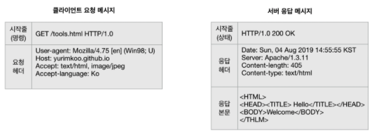
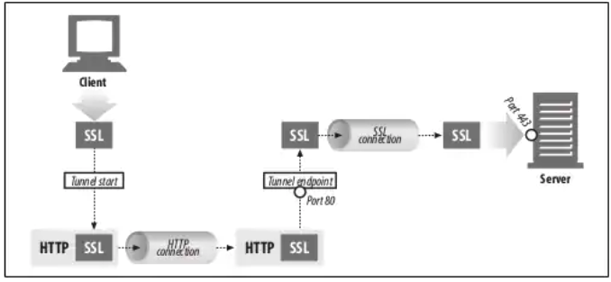

# HTTP
## HTTP의 역할

### 인터넷 미디어 배달
 - 수십업 개의 JPEG 이미지, HTML 페이지, 텍스트 파일, 동영상, 음성파일, 자바 애플릿 등을 전달.
 - 신뢰성 있는 데이터 전송 프로토클을 사요하기 때문에 데이터가 지구 반대편에서 와도 전송 중에 손상되거나 꼬이지 않음을 보장한다.

### 웹 클라이언트와 서버
 - HTTP가 웹 트래픽을 어떻게 전송하는지 더 자세히 알아보자
 - 웹 콘텐츠는 웹 서버에 존재한다. 웹 서버는 HTTP 프로토콜로 의사소통 하기 때문에 보통 HTTP 서버라고 불린다.
 - 클라이언트는 서버에게 HTTP 요청을 보내고 서버는 요청된 데이터를 HTTP 응답으로 돌려준다.

### 리소스
 - 웹 서버는 웹 리소스를 관리하고 제공한다.
 - 가장 단순한 웹 리소스는 웹 서버 파일 시스템의 정적 파일이다. 정적 파일은 텍스트 파일, HTML 파일, JPEG 이미지, 동영상 파일 외 모든 종류의 파일을 포함한다.
 - 그러나 리소스는 반드시 정적 파일이어야 할 필요는 없다. (프로그램이 될 수도 있다, 어떤 종류의 콘텐츠 소스도 리소스가 될 수 있다.)

### 미디어 타입
 - 인터넷은 수천 가지의 데이터 타입을 다루기 때문에 HTTP는 웹에서 전송되는 객체 가각에 신중하고 MIME(Multipurpose Internet Mail Extensions) 타입이라는 데이터 포멧 라벨을 붙인다.
 - MIME는 원래 각기 다른 전자메일 시스템 사이에서 메시지가 오갈 때 겪는 문제점을 해결하기 위해 설계되었다. 
 - 웹 서버는 모든 HTTP 객체 데이터에 MIME 타입을 붙인다. ({Primary Object type}/{Specific subtype} 포멧으로 이뤄진다.)
    - HTML로 작성된 텍스트 문서는 `text/html`라벨이 붙는다.
    - Plain ASCII 텍스트 문서는 `text/plain`라벨이 붙는다.
    - GIF 이미지는 `image/gif`가 된다.

### URI(Uniform Resource Identifier)
 - 웹 서버 리소스는 각자 이름을 갖고 있기 때문에, 클라이언트는 관심 있는 리소스를 지목할 수 있다. (서버 리소르 이름은 URI라고 불린다.)
 - URI에는 URL, URN 두 종류의 식별자가 있다.

### URL(Uniform Resource Locator)
 - 리소스 식별자의 가장 흔한 형태이다.
 - 특정 서버의 한 리소스에 대한 구체적인 위치를 서술한다.
 - 리소스가 정확히 어디에 있고 어떻게 접근할 수 있는지 분명히 알려준다.
 - URL은 세 부분으로 이루어진 표준 포멧을 따른다.
    - 첫 번째 부분 : Schem, 리소스에 접근하기 위해 사용되는 프로토콜을 서술한다. (ex, `http://`)
    - 두 번째 부분 : 인터넷 주소 (ex, `www.account.samsung.com`)
    - 마지막 부분 : 웹 서버의 리소스를 가리키는 부분 (ex, `/terms/ko/kr/file.html`)
 - 오늘날의 대부분의 URI는 URL이다.

### URN(Uniform Resource Name)
 - 콘텐츠를 이루는 한 리소스에 대해 그 리소스의 위치에 영향 받지 않는 유일무이한 이름 역할
 - URN은 리소스를 여기 저기로 옮기더라도 문제없이 동작한다.
 - 리소스가 어디에 있거나(심지어 여러 군데에 복사되었더라도) 그것을 지칭하기 위해 사용할 수 있다.

### 트랜젝션
 - HTTP 트랜젝션은 요청 명령과 응답결과로 구성된다. 이는 HTTP 메시지라고 불리는 정형화된 데이터 덩어리를 이용해 이루어진다.

#### 메서드
 - HTTP는 HTTP 메서드라고 불리는 여러 가지 종류의 요청 명령을 지원한다.
 - 모든 HTTP 요청 메시지는 하나의 메서드를 갖는다. 이는 서버에게 어떤 동작이 취해져야 하는지 말해준다.

|HTTP 메서드|설명|
|------|---|
|GET|서버에서 클라이언트로 지정한 리소스를 보내라.|
|PUT|클라이언트에서 서버로 보낸 데이터를 지정한 이름의 리소스로 저장하라.|
|DELETE|지정한 리소스를 서버에서 삭제하라|
|POST|클라이언트 데이터를 서버 게이트웨이 애플리케이션으로 보내라.|
|HEAD|지정한 리소스에 대한 응답에서 HTTP 헤더 부분만 보내라|

#### 상태코드
 - 모든 HTTP 응답 메시지는 상태코드와 함께 반환된다.
 - 클라이언트에게 요청이 성공했는지, 추가 조치가 필요한지 알려주는 세자리 숫자다.

|HTTP 상태 코드|설명|
|------|---|
|200|좋다. 문서가 바르게 반환되었다.|
|302|다시 보내라. 다른 곳에 가서 리소스를 가져가라.|
|404|없음. 리소스를 찾을 수 없다.|

### 메시지
 - HTTP 메시지는 단순한 줄 단위의 문자열이다.(이진 형식이 아닌 일반 텍스트이기 때문에 사람이 읽고 쓰기가 쉽다.)
 - 메시지는 요청 메시지(클라이언트 -> 서버)와 응답 메시지(서버 -> 클라이언트) 두 종류 뿐이다.
 - 메지지는 다음 세 부분으로 구성된다.
    - 시작줄 : 메시지의 첫줄로, 요청이라면 무엇을 해야하는지, 응답이라면 무슨 일이 일어났는지를 나타낸다.
    - 헤더 : 시작줄 다음에 0개 이상의 헤더 필드가 이어진다. 헤더는 빈 줄로 끝난다.
    - 본문 : 헤더의 빈 줄 다음에는 어떤 종류의 데이터든 들어갈 수 있는 메시지 본문이 필요에 따라 올 수 있다.

### TCP 커넥션
 - HTTP 메시지가 어떻게 TCP(Transmission Control Protocol, 전송 제어 프로토콜) 커넥션을 통해서 한 곳에서 다른 곳으로 옮겨가는지 알아본다.

#### TCP/IP
 - HTTP는 애플리케이션 계층 프로토콜이다. HTTP는 네트위크 통신의 핵심적인 세부사항에 대해서 신경쓰지 않는다. 대신 대중적이고 신뢰성 있는 인터넷 전송 프로토콜인 TCP/IP에게 맡긴다.
 - TCP/IP는 다음을 제공한다.
    - 오류 없는 데이터 전송
    - 순서에 맞는 전달
    - 조각나지 않는 데이터 스트림
 - TCP/IP는 각 네트워크와 하드웨어의 특성을 숨기고 어떤 종류의 컴퓨터나 네트워크 든 서로 신회성 있는 의사소통을 하게 해준다.
 - 일단 TCP 커넥션이 맺어지면, 클라이언트와 서버 컴퓨터 간에 교환되는 메시지가 없어지거나 손상되거나 순서가 뒤바뀌어 수신되는 일은 결코 없다.

#### 접속, IP 주소와 포트번호
 1. 웹브라우저는 서버의 URL에서 호스트 명을 추출한다.
 2. 웹브라우저는 서버의 호스트 명을 IP로 변환한다.
 3. 웹브라우저는 URL에서 포트번호(있다면, 없다면 80이 기본)를 추출한다.
 4. 웹브라우저는 웹 서버와 TCP 커넥션을 맺는다.
 5. 웹브라우저는 서버에 HTTP 요청을 보낸다.
 6. 서버는 웹브라우저에 HTTP 응답을 돌려준다.
 7. 커넥션이 닫히면, 웹브라우저는 문서를 보여준다.

### 웹의 구성요소

#### Proxy
 - 웹 보안, 애플리케이션 통합, 성능 최적화를 위한 중요한 구성요소인 HTTP 프락시 서버에 대해서 알아본다.
 - 프락시는 클라이언트와 서버 사이에 위치하여, 클라이언트의 모든 HTTP 요청을 받아 서버에 전달한다.
 - 이 애플리케이션은 사용자를 위한 프락시로 동작하며 사용자를 대신에서 서버에 접근한다.
 - 프락시는 주로 보안을 위해 사용한다. 즉, 모든 웹 트래픽 흐름 속에서 신뢰할 만한 중개자 역할을 한다.
 - 프락시는 요청과 응답을 필터링한다. (회사에서, 공공기관에서 사용된다.)

#### 캐시
 - 웹캐시와 캐시 프락시는 자신을 거쳐 가는 문서들 중에 자주 찾는 것의 사본을 저장해두는 특별한 종류의 프락시 서버다.
 - 다음번에 클라이언트가 같은 문서를 요청하면 그 캐시가 갖고 있는 사본을 받을 수 있다.
 - HTTP는 캐시를 효율적으로 동작하게 하고, 캐시된 컨텐츠를 최신 버전으로 유지하면서 동시에 프라이버시도 보호하기 위한 많은 기능을 정의한다.

#### 게이트웨이
 - 게이트웨이는 주로 HTTP 트래픽을 다른 프로토콜로 변환하기 위해 사용된다.
 - 게이트웨이는 언제나 스스로가 리소스를 갖고 있는 진짜 서버인 것 처럼 요청을 다룬다.(클라이언트는 자신이 게이트웨이와 통신하고 있음을 알아채지 못할 것이다.)
 - HTTP/FTP 게이트웨이는 FTP URI에 대한 HTTP 요청을 받아들인 뒤, FTP 프로토콜을 이용해 문서를 가져온다. 받아온 문서는 HTTP 메시지에 담겨 클라이언트에게 보낸다.

#### 터널
 - 터널은 두 커넥션 사이에서 RAW 데이터를 열어보지 않고 그대로 전달해주는 HTTP 애플리케이션이다. 
 - HTTP 터널은 주로 비 HTTP 데이터를 하나 이상의 HTTP 연결을 통해 그대로 전송해주기 위해 사용된다.
 - 암호화된 SSL 트래픽을 HTTP 커넥션으로 전송함으로써 웹 트래픽만 허용하는 사내 방화벽을 통과시키는 것이 있다.
