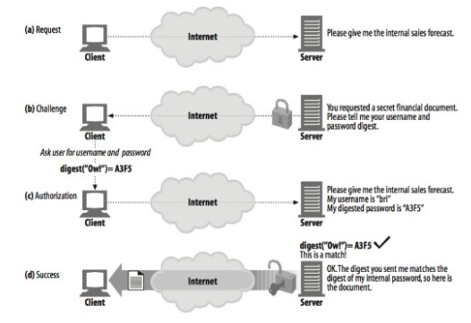
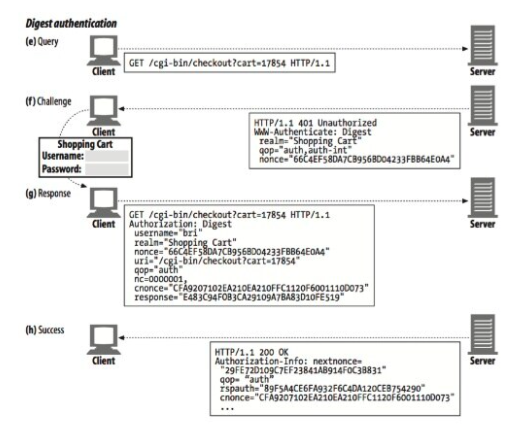

# 다이제스트 인증

기본인증은 편리하고 유연하지만 전혀 안전하지 않다. 사용자 이름과 비밀번호를 평문으로 보내고, 메시지를 위조하지 못하게 보호하려는 어떠한 시도도 하지 않는다.
기본 보안을 안전하게 이용하는 유일한 방법은 SSL과 결합해서 사용하는 것이다.

* 다이제스트 인증은 기본인증과 호환되는 더 안전한 대체제로 개발되었다.
* 다이제스트 인증은 널리 쓰이지는 않지만, 그 개념은 보안 트랜잭션을 구현하고자 하는 이들에게 여전히 유용하다.

## 다이제스트 인증의 개선점

다이제스트 인증은 기본 인증의 가장 심각한 결함을 수정한 또 다른 HTTP 인증 프로토콜이다.

* 비밀번호를 절대로 네트워크를 통해 평문으로 전송하지 않는다.
* 인증 체결을 가로채서 재연하련는 악의적인 사람들의 의도를 차단한다.
* 구현하기에 따라서, 메시지 내용 위조를 막는 것도 가능하다.
* 그 외 몇몇 잘 알려진 형태의 공격을 막는다.

다이제스트 인증이 가능한 가장 안전한 프로토콜은 아닌다. 예를들어, 공개키 기반 메커니즘과 비교해 보았을 때 다이제스트 인증은 그다지 강력한 인증 메커니즘을 제공하지 않는다. 또한 다이제스트 인증은 비밀번호 자체를 보호하는 것을 넘어서 어떠한 비밀 보호도 제공하지 않는다. 즉, 요청과 응답의 나머지 부분에 대해서는 다른 누군가가 엿보는 것이 가능하다.

그럼에도 다이제스트는 기본인증보다 훨씬 강력하다. 그러나 아직까지 많이 사용되고 있지 않다.

### 비밀번호를 안전하게 지키기 위해 요약 사용하기

* 다이제스트는 절대 비밀번호를 네트워크를 통해 보내지 않는다.
* 비밀번호를 보내는 대신 클라이언트는 비밀번호를 비가역적으로 뒤섞은 `fingerprint` 혹은 `digest`를 보낸다.
* 클라이언트와 서버는 모두 비밀번호를 알고있으므로, 서버는 클라이언트가 보낸 요약이 비밀번호에 알맞게 대응하는지 검사할 수 있다.

### 단방향 요약

요약은 정보 본문의 압축이다. 요약은 단방향 함수로 동작하고, 일반적으로 입력 가능한 무한 가지의 모든 입력값들을 유한한 범위의 압축으로 변환한다.
인기있는 해시함수 중 하나인 MD5는 임의의 바이트 배열을 원래 길이와 상관없이 128비트 요약으로 변환한다.

> MD5는 다이제스트 알고리즘 시리즈 중 하나인 `Message Digest #5`의 약어다. 보안 해시 알고리즘(Secure Hash Algorithm, SHA)은 또 하나의 인기 있는 다이제스트 함수다.

* 이 요약에서 중요한 것은, 만약 비밀번호를 모른다면 서버에게 보내줄 알맞은 요약을 추측하기 위해서 끔찍하게 많은 시간을 소모해야한다는 점이다.
* 요약을 갖고 있다면 거의 무한개의 입력값들 중 그 요약을 생성하는 것을 찾기 위해 끔찍하게 많은 시간을 소모하게 될 것이다.
* 128비트의 MD5 출력은 종종 32글자의 16진수 문자로 표현되며 각 문자는 각각 4비트의 값을 의미한다.
* 요약함수는 보통 암호 체크섬으로 불리며, 단방향 해시함수이거나 지문함수이다.

### 재전송 방지를 위한 Nonce 사용

단방향 요약은 비밀번호를 그대로 전송해야 할 필요성에서 우리를 해방시켜준다. 그 대신 그냥 비밀번호에 대한 요약을 보내주고 악의적인 집단이 쉽게 요약에서 원래 비밀번호를 해독할 수 없음을 보장받기만 하면된다.
요약은 비밀번호 자체와 다름없기 때문에 요약자체를 재전송하는 경우가 발생할 수 있다.

* 이런 재전송 공격을 방지하기 위해서 서버는 클라잉너트에게 Nonce라고 불리는 특별한 그리고 자주 바뀌는(대략 1밀리초마다, 혹은 인증할때마다) 증표를 건네준다.
* Nonce를 비밀번호에 섞으면 Nonce가 바뀔때마다 요약도 바뀌게 만들어준다.
* 이것은 재전송 공격을 막아주는데 왜냐하면 저장된 비밀번호 요약은 특정 난스 값에 대해서만 유효하고, 비밀번호 없이 공격자가 올바른 요약을 계산하는 것은 가능하지 않기 때문이다.
* Nonce는 WWW-Authenticate 인증요구에 담겨서 서버에서 클라이언트로 넘겨진다.

### 다이제스트 인증 핸드셰이크

* HTTP 다이제스트 인증 프로토콜은 기본 인증에서 사용하는 것과 비슷한 헤더를 사용하는, 강화된 버전의 인증이다.
* 기존 헤더에 몇몇 새 옵션이 추가되었고, 선택적인 헤더인 Authorization-Info가 새로 추가되었다.

## 요약 계산

다이제스트 인증의 핵심은 공개된 정보, 비밀 정보, 시한부 Nonce 조합한 단방향 요약이다.

### 요약 알고리즘 입력 데이터

* 단방향 해시 함수 H(d)와 요약함수 KD(s,d). 여기서 s는 비밀(secret)을, d는 데이터를 의미한다.
* 비밀번호 등 보안 정보를 담고 있는 데이터 덩어리. A1이라 칭한다.
* 요청 메시지의 비밀이 아닌 속성을 담고 있는 데이터 덩어리. A2라고 칭한다.

### H(d)와 KD(s,d) 알고리즘

* MD5(기본)과 MD5-sess 제공

### 보안관련 데이터(A1)

* A1으로 불리는 데이터 덩어리는 사용자 이름, 비밀번호, 보호영역, 난스와 같은 비밀 보호 정보로 이루어져 있다.

### 메시지 관련 데이터(A2)

* A2로 불리는 데이터 덩어리는 URL, 요청 메서드, 메시지 엔티티 본문과 같은 메시지 자체의 정보를 나타낸다. 
* A2는 메서드, 리소스, 메시지의 위조를 방지하기 위해 사용된다.

## 보호 수준(Quality of Protection) 향상

* qop 필드는 클라이언트와 서버가 어떤 보호 기법을 어느 정도 수준으로 사용할 것인지 협상할 수 있게 해준다.

### 메시지 무결성 보호

* 무결성 보호가 적용되었을 때 계산되는 엔터티 본문은, 메시지 본문의 해시가 아닌 엔터티 본문의 해시이다.
* 송신자에 의해 어떠한 전송 인코딩이 적용되기도 전에 먼저 계산되고 그 후 수신자에 의해 제거된다.

### 다이제스트 인증 헤더

* 기본, 다이제스트 인증은 WWW-Authentication 헤더에 담겨 전달되는 인증요구와, Authentication 헤더에 담겨 전달되는 인기 응답을 포함한다.
* 다이제스트는 Authentication-Info 헤더를 추가했다.
* 3단계 핸드셰이크를 완성하고 다음번 사용할 난스를 전달하기 위해 인증 성공 후에 전송된다.

## 실제 상황에 대한 고려

### 다중 인증요구

* 서버는 한 리소스에 대해 여러 인증을 요구할 수 있다.
* 다양한 인증 옵션을 제공하는 경우, ‘가장 허약한 부분‘에 대한 보안우려가 있다는 것이 명확하다.
* 서버는 기본인증을 제한적으로만 사용해야 할 것이며, 관리자는 사용자에게 보안 수준이 다른 여러 시스템에서 같은 비밀번호를 사용하는 것의 위험성에 대해 경고해야 할 것이다.

### 오류처리

* 지시자나 그 값이 적절하지 않거나 요구된 지시자가 빠져 있으면, 응답은 400 Bad Request이다.
* 인증 서버는 uri 지시자가 가리키는 리소스가 요청줄에 명시된 리소스와 같음을 확인해야 한다.
* 반복된 실패에 대해서는 따로 기록해 두는 것이 좋다.

### 보호 공간(Protection Space)

* 영역 값은 접근한 서버의 루트 URL과 결합되어 보호 공간을 정의한다.
* 영역 값은 원 서버에 의해 할당되는 문자열이며 인증 제도에 추가적인 의미를 더한다.
* 보호 공간은 어떤 자격이 자동으로 적용되는 영역을 정한다.

### URI 다시 쓰기

* 프락시는 가리키는 리소스의 변경 없이 구문만 고쳐서 URI를 다시 쓰기도 한다.
    * 호스트 명은 정규화되거나 IP 주소로 대체된다.
    * 문자들은 % escape 형식으로 대체될 수 있다.
    * 서버로부터 가져오는 리소스에 영향을 주지 않는, 타입에 대한 추가 속성이 URI의 끝에 붙거나 중간에 삽입될 수 있다.

### 캐시

* Authorization 헤더를 포함한 요청과 그에 대한 응답을 받은 경우, 두 Cache-Control 지시자 중 하나가 응답에 존재하지 않는 한 다른 요청에 대해 응답을 반환해서는 안된다.
 * 만약 원 서버의 응답이 `must-revalidate` Cache-Control 지시자를 포함한 경우, 캐새는 그 응답의 엔티티를 다음 요청에 대한 응답을 위해 활용할 것이다. 그라나 원 서버가 새 요청을 인증할 수 있도록, 우선 그 요청의 헤더를 이용해서 재검사를 수행해야 한다.
 * 만약 원 서버의 응답이 `public` Cache-Control 지시자를 포함한 경우, 응답 엔터티는 그 다음에 오는 임의의 요청에 대한 응답으로 반환될 수 있다.

## 보안에 대한 고려사항

### 헤더 부당 변경

* 헤더 부당 변경에 대해 안전한 시스템을 제공하기 위해서, 양 종단 암호화나 헤더에 대한 디지털 서명이 필요하다.

### 재전송 공격

* 폼 데이터를 전송할 때 이전에 사용했던 자격을 재사용해도 문제없이 동작한다면, 큰 문제가 생기게 된다.
* 재전송 공격을 완전히 피하기 위해서는 매 트랜잭션마다 유일한 난스 값을 사용하는 것이다.
* 서버는 매 트랜잭션마다 난스와 함께 타임아웃 값을 발급한다.

### 다중 인증 메커니즘

* 클라이언트에게 항상 가장 강력한 인증제도를 선택하도록 한다.
* 가장 강력한 인증 제도만을 유지하는 프락시 서버를 사용한다.

### 사전 공격

* 전형적인 비밀번호 추측 공격이다.
* 비밀번호 만료 정책이 없고, 충분한 시간이 있고, 비밀번호를 크래킹할 비용을 치를 수 있다면, 비밀번호를 쉽게 수집할 수 있다.
* 크래킹하기 어렵도록 복잡한 비밀번호를 사용하고 괜찮은 비밀번호 만료 정책을 사용하는 것이 좋다.

### 악의적인 프락시와 중간자 공격

* 프락시중 하나가 악의적이거나 보안이 허술하다면 클라이언트는 중간자 공격에 취약한 상태가 될 수 있다.
* 프락시는 보통 정교한 프로그래밍 인터페이스를 제공하므로 그러한 프락시들을 이용하는 플러그인을 이용하여 트래픽을 가로채 수정하는 것이 가능하다.
* 이 문제를 해결하기에는 한계가 있으므로, 클라이언트가 가능한 가장 강력한 인증을 선택하도록 설정한다.

### 선택 평문 공격

* 보안이 허술하거나 악의적인 프락시가 트래픽 중간에 끼어든다면, 클라이언트가 응답 계산을 하기 위한 난스를 제공 할 수 있다.
* 응답을 계산하기 위해 알려진 키를 사용하는 것은 응답의 암호 해독을 쉽게 한다.
* 클라이언트가 서버에서 제공된 난스 대신 선택적인 c난스 지시자를 사용하여 응답을 생성할 수 있도록 설정하는 것이 좋다.

### 비밀번호 저장

* 다이제스트 인증 비밀번호 파일이 유출되면 영역의 모든 문서는 공격자에게 노출된다.
* 비밀번호 파일이 평문으로 된 비밀번호를 포함하고 있다고 생각하고 안전하게 보호한다.
* 영역 이름이 유일함을 보장한다.