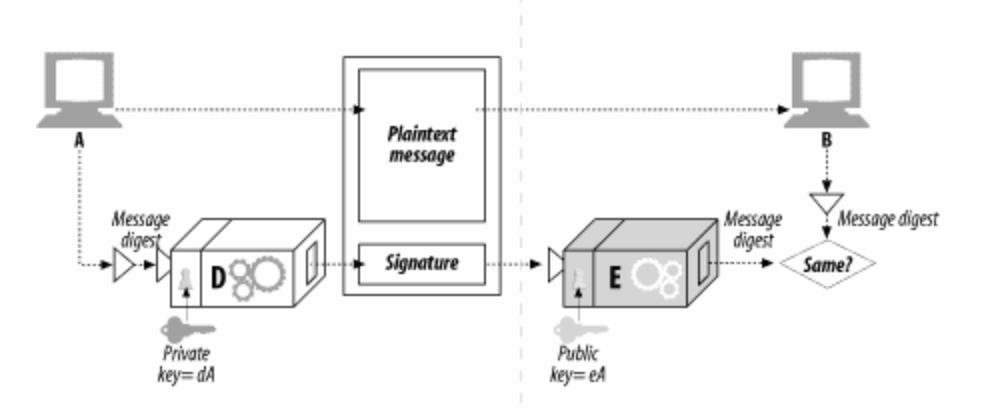
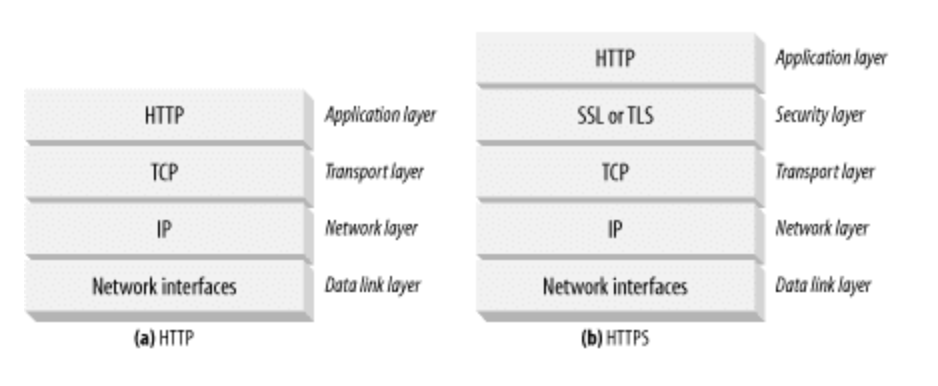
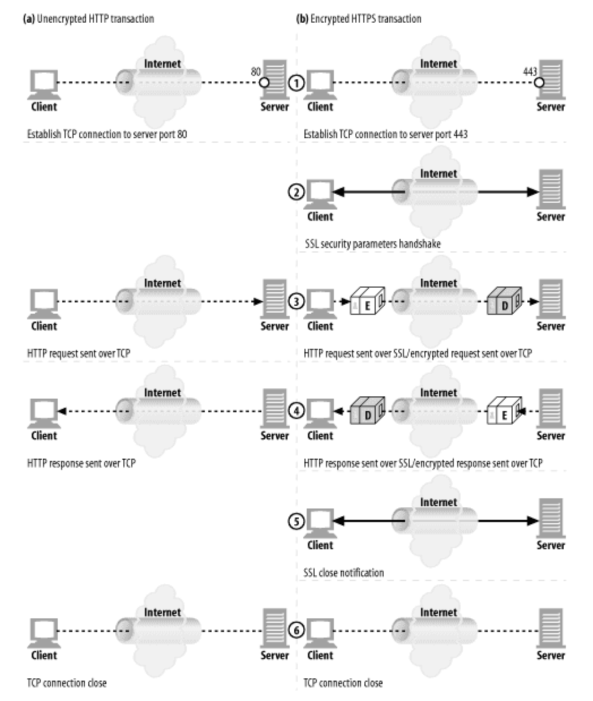
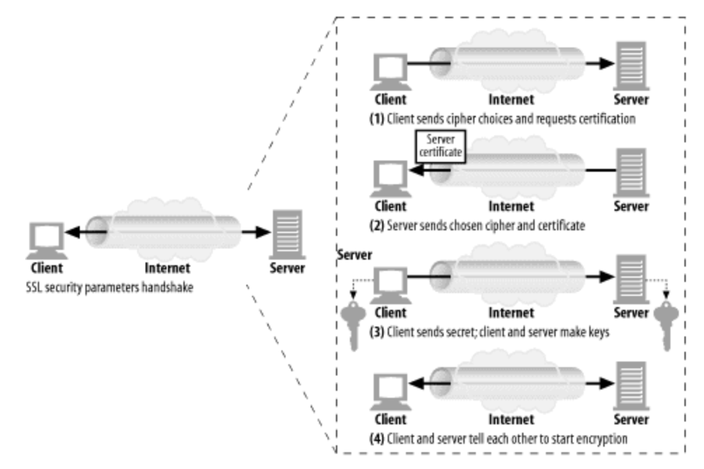

### 혼성암호 체계와 세션 키
 - 비대칭 공개키 암호 방식은 누구나 공개키만 알면 그 키에 대응되는 공개 서버에 안전하게 메시지를 보낼 수 있게 해주므로 매우 훌륭하다.
 - 그러나 공개키 암호 방식의 알고리즘은 계산이 느린 경향이 있다. 실제로는 대칭과 비대칭 방식을 섞은 것이 쓰인다.
 - 노드들 사이의 안전한 의사소통 채널을 수립할 때는 편리하게 공개 키 암호를 사용하고, 이렇게 만들어진 안전한 채널을 통해 임시의 무작위 대칭 키를 생성하고 교환하여 이후의 나머지 데이터를 암호화할 때는 빠른 대칭키를 사용하는 방식이 흔히 쓰인다.

## 디지털 서명
 - 암호 체계는 미시지를 암호화하고 해독하는 것뿐 아니라, 누가 메시지를 썻는지 알려주고 그 메시지가 위조되지 않았음을 증명하기 위해 메시지에 서명을 하도록 하는 데에 이용될 수 있다.
 - 디지털 서명은 인터넷 보안 인증서에게 중요하다.

### 서명은 암호 체크섬이다.
 - 서명은 메시지를 작성한 저자가 누군지 알려준다.(체크섬은 저자 개인 서명처럼 동작한다.)
 - 서명은 메시지 위조를 방지한다.(침입자는 위조된 메시지에 대한 올바름 체크섬을 날조해낼 수 없다.)
 
 
 - A는 가변 길이 메시지를 정제하여 고정된 길이의 digest로 만든다.
 - A는 그 Digest에, 사용자의 Secret Key를 매개변수로 하는 Signature 함수를 적용한다.
 - 오직 그 사용자만이 Secret Key를 알고 있기 때문에, 올바른 서명 함수는 서명자가 소유자임을 보여준다.
 - 서명 함수로 디코더 함수 D를 사용한 이유는, 그 함수가 사용자의 Secret Key와 관련되어 있기 때문이다.
 - 한번 서명이 계산되면, A는 그것을 메시지의 끝에 덧붙이고, 메시지와 그에 대한 서명 둘 다를 B에게 전송한다.
 - B는 발송자가 A이며 메시지가 위조되지 않았다는 것을 증명하기 위해 서명을 검사할 수 있다.
 - B는 A의 Secret Key로 변형된 Signature에 Public Key를 이용한 역함수를 적용한다.
 - 만약 풀어낸 Digest가 B가 갖고 있는 Digest와 다르다면, 메시지가 송신 중에 위조되었거나 아니면 발송자가 A의 Secret Key를 갖고있지 않는 것이다. (즉, 메시지를 쓴 것은 A가 아니다)

## 디지털 인증서
 - 디지털 인증서(흔히 "cert"라고 불리는)는 신뢰할 수 있는 기관으로부터 보증 받은 사용자나 회사에 대한 정보를 담고있다.

### 인증서의 내부
 - 디지털 인증서에는 또한 공식적으로 "인증 기관"에 의해 디지털 서명된 정보의 집합이 담겨있다. 기본적으로 디지털 인증서는 보통 다음과 같이 인쇄된 ID에도 흔히 들어가게 되는 기본적인 것들을 담고 있다.
    - 대상의 이름(사람,서버,조직 등)
    - 유효 기간
    - 인증서 발급자(누가 이 인증서를 보증하는가)
    - 인증서 발급자의 디지털 서명

 - 추가적으로, 디지털 인증서는 대상과 사용된 서명 알고리즘에 대한 서술적인 정보 뿐만아니라 보통 대상의 공개키도 담고있다.
 - 누구나 디지털 인증서를 만들 수 있지만 그 모두가 인증서의 정보를 보증하고 인증서를 개인 키로 서명할 수 있는 널리 인증받는 서명 권한을 얻을 수 있는 것은 아니다.

### X.509 v3 인증서
 - 불행히도 디지털 인증서에 대한 전 세계적인 단일표준은 없다.
 - 다행히도 오늘날 사용되는 대부분의 인증서가 그들의 정보를 X.509라 불리는 표준화된 서실에 저장하고 있다.

### 서버 인증을 위해 인증서 사용하기
 - 사용자가 HTTPS를 통한 안전한 웹 트랜젝션을 시작할 때, 최신 브라우저느느 자동으로 접속한 서버에서 디지털 인증서를 가져온다.
 - 만약 서버가 인증서를 갖고 있지 않다면, 보안 커넥션은 실패한다.
 - 서버 인증서는 다음을 포함한 많은 필드들을 갖고 있다.
    - 웹 사이트의 이름과 호스트 명
    - 웹 사이트의 공개키
    - 서명 기관의 이름
    - 서명 기관의 서명

 - 브라우저가 인증서를 받으면, 서병 기관을 검사한다. 만약 그 기관이 공공이 신뢰할만한 서명 기관이라면 브라우저는 그것의 공개키를 이미 알고 있을 것이며(브라우저들은 여러 서명 기관의 인증서가 미리 설치된 채로 출하된다.)
 - 브라우저는 그 서명을 검증할 수 있다.
 - 만약 서명 기관이 모르는 곳이라면, 브라우저는 그 서명 기관을 신뢰해야 할지 확신할 수 없으므로, 대개 사용자가 서명 기관을 신뢰하는지 확인하기 위한 대화상자를 보여준다.

## HTTPS의 세부사항
 - HTTPS는 HTTP 프로토콜에 대칭, 비대칭 인증서 기반 암호 기법의 강력한 집합을 결합한 것이다. 

### HTTPS의 개요
 - HTTPS는 보안 전송 계층을 통해 전송되는 HTTP다.
 - 암호화되지 않은 HTTP 메시지를 TCP를 통해 전 세계의 인터넷 곳곳으로 보내는 대신에 HTTPS는 HTTP 메시지를 TCP로 보내기 전에 먼저 그것들을 암호화하고 보안 계층으로 보낸다.
 

 - 오늘날, HTTPS의 보안 계층은 SSL과 그것의 현대적 대체품인 TLS로 구현되었다.

### HTTPS 스킴
 - HTTP는 선택적으로 사용되는 것이기 때문에 웹서버에게 HTTP의 보안 프로토콜 버전을 수행한다는 의미로 URL 스킴을 이용한다.
 - 웹 브라우저 등의 클라이언트는 웹 리소스에 대한 트랜젝션 수행을 요청받으면 URL의 스킴을 검사한다.
    - 만약 URL이 http 스킴을 갖고 있다면, 클라이언트는 서버에 80번 포트로 연결하고 평범한 HTTP 명령을 전송한다.
    - 만약 URL이 https 스킴을 갖고 있다면, 클라이언트는 서버에 443 포트로 연결하고 서버와 바이너리 포멧으로된 몇몇 SSL 보안 매개변수를 교환하면서 핸드셰이크를 하고, 암호화된 HTTP 명령이 뒤를 잇는다.

### 보안전송 셋업
 - HTTPS에서 클라이언트는 먼저 웹 서버의 443 포트로 연결한다.
 - 일단 TCP 연결이 되고나면, 클라이언트와 서버는 암호법 매개변수와 교환 키를 협상하면서 SSL 계층을 초기화한다.
 - 핸드셰이크가 완료되면 SSL 초기화는 완료되며, 클라이언트는 요청 메시지를 보안 계층에 보낼 수 있다.
 - 이 메시지는 TCP로 보내지기 전에 암호화 된다.
 

### SSL 핸드셰이크
 - 암호화된 HTTP 메시지를 보낼 수 있게 되기 전에, 클라이언트와 서버는 SSL 핸드 셰이크를 할 필요가 있다.
    - 프로토콜 버전 번호 교환
    - 양쪽이 알고 있는 암호 선택
    - 양쪽 신원을 인증
    - 채널 암호화하기 위한 임시 세션 키 생성

 - 암호화된 HTTP 데이터가 네트워크를 오가기도 전에 SSL은 통신을 시작하기 위해 상당한 양의 핸드셰이크 데이터를 주고 받는다.
 

 - 이것은 SSL 핸드셰이크를 단순화한 버전이다. 

### 서버 인증서
 - 보안 HTTPS 트랜잭션은 항상 서버 인증서를 요구한다. 
 - 누군가가 웹서버에 신용카드 정보를 보내는 것과 같은 보안 트랜잭션을 수행할 때, 그는 대화 중인 조직이 그와 대화하고 있다고 생각한 조직이 맞는지 알고 싶을 것이다.
 - 잘 알려진 인증기관에 의해 서명된 서버 인증서는 그가 서버에 그의 신용카드나 개인정보를 보내기 전에 그 서버를 얼마나 신뢰할 수 있는지 평가하는 것을 도와줄 것이다.
 - 서버 인증서는 조직의 이름, 주소, 서버 DNS 도메인 이름, 그리고 그 외의 정보를 보여주는 X.509 v3에서 파생된 인증서다.
 - 사용자와 사용자의 클라이언트 소프트웨어는 모든 것이 믿을 만한 것인지 확인하기 위해 인증서를 검증할 수 있다.

### 사이트 인증서 검사
 - SSL 자체는 사용자에게 웹 서버 인증서를 검증할 것을 요구하지 않지만, 최신 웹르라우저들 대부분은 인증서에 대해 간단하게 기본적인 검사를 하고 그 결과를 더 철저한 검사를 할 수 있는 방법과 함께 사용자에게 알려준다.
    - 날짜검사(인증서 시작 및 종료일)
    - 서명자 신뢰도 검사(Certificate Authority 검사)
    - 서명 검사
    - 사이트 신원 검사