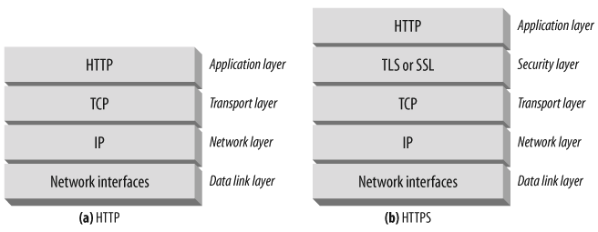
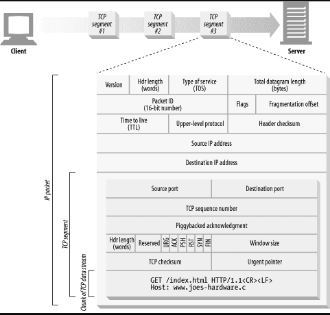
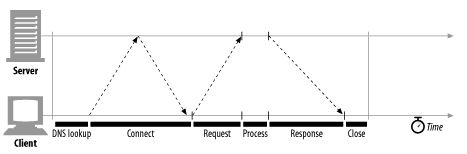
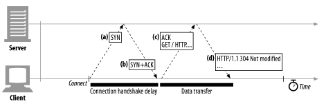
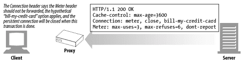
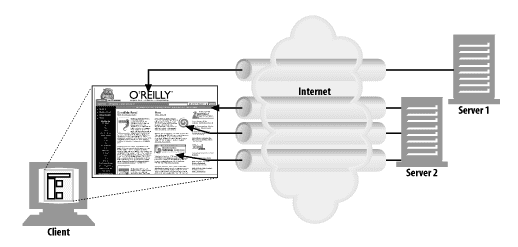
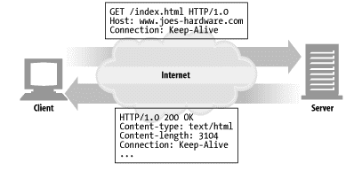
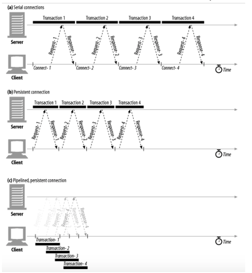

# HTTP Connection Management

## TCP Connection
 - TCP/IP Connection은 일단 맺어지면 클라이언트와 서버 컴퓨터 간 주고 받는 메시지들은 손실 혹은 손상되거나 순서가 바뀌지 않고 안전하게 전달된다.
 - `http:// www.naver.com:80/index.html`을 예로들어보자,

 * 브라우저가 http:// www.naver.com라는 호스트 명을 추출한다.
 * 브라우저가 이 호스트 명에 대한 IP주소를 찾는다.
 * 브라우저가 포트번호(80)를 얻는다.
 * 브라우저가 202.43.78.3의 80포트로 TCP 커넥션을 생성한다.
 * 브라우저가 서로의 HTTP GET 요청 메시지를 보낸다.
 * 브라우저가 서버에서 온 HTTP 응답 메시지를 읽는다.
 * 브라우저가 커넥션을 끊는다.

### 신뢰할 수 있는 데이터 전송 통로인 TCP

#### TCP 스트림은 세그멘트로 나뉘어 IP 패킷을 통해 전송된다.
 - TCP는 IP 패킷(혹은 IP 데이터그램)이라고 불리는 작은 조각을 통해 데이터를 전송한다.
 - HTTP는 `IP, TCP, HTTP`로 구성된 프로토콜 스택에서 최상위 계층이다.
 - HTTP에 보안기능을 더한 HTTPS는 TLS 혹은 SSL이라 불리기도 하며 HTTP와 TCP 사이에 있는 암호화 계층이다.
 

 - HTTP 가 메시지를 전송하고자 할 경우, 현재 연결되어 있는 TCP 커넥션을 통해서 메시지 데이터의 내용을 순서대로 보낸다. 
 - TCP는 세그먼트라는 단위로 데이터 스트림을 잘게 나누고 세그먼트를 IP 패킷이라고 불리는 봉투에 담아서 인터넷을 통해 데이터를 전달한다.
 - 각 TCP 세그먼트는 하나의 IP주소에서 다른 IP 주소로 IP 패킷에 담겨 전달된다.
 * IP 패킷 헤더(보통 20바이트)
 * TCP 세그먼트 헤더(보통 20바이트)
 * TCP 데이터 조각(0혹은 그 이상의 바이트)
 

#### TCP Connection 유지하기
 - 컴퓨터는 항상 TCP 커넥션을 여러 개 가지고 있다. TCP는 포트 번호를 통해서 이런 여러 개의 커넥션을 유지한다.
 - TCP 커넥션은 네 가지 값으로 식별한다.(`발신지 IP주소, 발신지 포트, 수신지 IP 주소, 수신지 포트`)
 - 이 네가지 값으로 유일한 커넥션을 생성한다. 서로 다른 두 개의 TCP 커넥션은 네 가지 주소 구셩요소의 값이 모두 같을 수 없다.

### TCP 성능에 대한 고려
 - HTTP는 TCP 바로 위에 있는 계층이기 때문에 HTTP 트랜젝션의 성능은 그 아래 계층인 TCP 성능에 영향을 받는다. 기본적인 TCP 성능의 특성을 이해함으로써, HTTP의 커넥션 최적화 요소들을 더 잘 알게 되고, 더 좋은 성능의 HTTP 애플리케이션을 설계하고 구현할 수 있게 될 것이다.

#### HTTP 트랜잭션과 지연
 - HTTP 요청 과정에서 어떤 네트워크 지연이 발생하는지 살펴본다. 그림 4-7에서는 HTTP의 주요 커넥션, 전송, 처리의 지연을 보여준다.
 
 
 - 트랜잭션을 처리하는 시간은 TCP 커넥션을 설정하고, 요청을 전송하고, 응답 메시지를 보내는 것에 비하면 상당히 짧은 것을 알 수 있다.
 - 클라이언트나 서버가 너무 많은 데이터를 내려받거나 복잡하고 동적인 자원들을 실행하지 않는 한, 대부분의 HTTP 지연은 TCP 네트워크 지연 때문에 발생한다.
 - HTTP 트랜젝션을 지연시키는 여러가지 원인들
 * 클라이언트는 도메인 네임을 통해 IP를 알아내야 한다. 접근한 기록이 없다면 DNS를 거쳐야 한다.
 * 서버에 TCP 커넥션 요청을 보낸다.
 * 커넥션이 맺어지면 HTTP 요청을 생성된 TCP 파이프를 통해 전송한다.
 * 웹 서버가 응답을 보내는 시간이 걸린다.

#### 성능관련 중요 요소 (가장 일반적인 TCP 관련 지연들)
 - TCP 커넥션의 Hand shake 설정
 - 인터넷의 혼잡을 제어하기 위한 TCP의 slow-start
 - 데이터를 한데 모아 한번에 전송히가 위한 네이글(nagle) 알고리즘
 - TCP의 편승(piggyback) 확인응답(acknowledgment)을 위한 확인응답 지연 알고리즘
 - TIME_WAIT 지연과 포트 고갈

#### TCP Connection Handshake 지연
 - 어떤 데이터를 전송하든 새로운 TCP 커넥션을 열 때면, TCP 소프트웨어는 커넥션을 맺기 위한 조건을 맞추기 위해 연속으로 IP 패킷을 교환한다.
 - 작은 크기의 데이터 저송에 커넥션이 사용된다면 이런 패킷 교환은 HTTP 성능을 크게 저하시킬 수 있다.
 

 * 클라이언트는 새로운 TCP 커넥션을 생성하기 위해 작은 TCP 패킷(보통 40~60 바이트)을 서버에게 보낸다. 그 패킷은 `SYN`라는 특별한 플래그를 가지는데, 이 요청이 커넥션 생성 요청이라는 뜻이다.(a)
 * 서버가 그 커넥션을 받으면 몇 가지 커넥션 매개변수를 산출하고, 커넥션 요청이 만들어졌음을 의미하는 `SYN`, `ACK` 플래그를 포함한 TCP 패킷을 클라이언트에게 보낸다(b)
 * 마지막으로 클라리언트는 커넥션이 잘 맺어졌음을 알리기 위해서 서버에게 다시 확인응답 신호를 보낸다(c). 요즘의 TCP는 클라이언트가 이 확인응답 패킷과 함께 데이터를 보낼 수 있다.

 - HTTP 트랜잭션이 아주 큰 데이터를 주고받지 않는 평범한 경우에는 SYN/SYN+ACK 핸드셰이크가 눈에 띄는 지연을 발생히키다. TCP의 ACK 패킷(c)은 HTTP 요청 메시지의 전체를 전달할 수 있을 만큼 큰 경우가 많고, 많은 HTTP 서버 응답 메시지는 하나의 IP 패킷에도 담길 수 있다.
 - 결국 크기가 작은 HTTP 트랜젝션은 50% 이상의 시간을 TCP를 구성하는데 쓴다. 이후 절에서는 이러한 TCP 구성으로 인한 지연을 제거하기 위해서 HTTP가 이미 존재하는 커넥션을 어떻게 활요하는지 알아볼 것이다.

#### 확인응답 지연
 - 인터넷 자체가 패킷 전송을 완벽히 보장하지는 않기 때문에(인터넷 라우터는 과부하가 결렸을 때 패킷을 마음대로 파기할 수 있다.) TCP는 성공적인 데이터 전송을 보장하기 위해서 자체적인 확인 체계를 가진다.
 - 각 TCP 세그먼트는 순번과 데이터 무결성 체크섬을 가진다. 각 세그먼트의 수신자는 세그먼트를 온전히 받으면 작은 확인응답 패킷을 송신자에게 반환한다. 만약 송신자가 특정 시간 안에 확인응답을 받지 못하면 패킷이 파기외었거나 오류가 있는 것으로 판단하고 데이터를 다시 전송한다.
 - 확인응답은 크기가 작기 때문에 TCP는 같은 방향으로 송출되는 데이터 패킷에 확인응답을 `편승(piggyback)` 시킨다. TCP는 송출 데이터 패킷과 확인응답을 하나로 묶음으로써 네크워크를 좀 더 효율적으로 사용한다.
 - 확인응답 지연은 효율적으로 확인응답을 보내기 위해 동승할 패킷을 위해 기다리는 행위이다. 기다리다 늦어지면 물론 별도의 패킷을 만들어야 한다.

#### TCP Slow start
 - 패킷의 전송속도는 네트워크 대역폭에 따라 결정되는데, 네트워크의 대역폭은 미리 알수가 없다. 너무 많은 데이터를 보내서 대역폭이 감당을 하지 못하면 문제가 발생하기 때문에 안전을 위해 낮은 속도로 먼저 보내다가, 조금씩 늘리게 된다. 이를 slow-start라 한다.

#### Nage 알고리즘과 TCP_NODELAY
 - 네이글 알고리즘은 네티워크 효율을 위해서, 패킷을 전송하기 전에 많은 양의 TCP 데이터를 한 개의 덩어리로 합친다. 보낼 데이터를 바로 보내지 않고 모았다가 같이 보내게 되는데 데이터가 모일때까지 기다려야 하기 때문에 딜레이가 생긴다.

### HTTP Connection 관리

#### 흔히 잘못 이해하는 Connection 헤더

 - 아래 Conntection 과 Meter 는 커넥셔 커넥션 헤더 값이다.
 
 - 일단 모든 커넥션 헤더 값은 현재 커넥션에만 해당하고 다음 커넥션에는 전달하면 안된다. 그런데 이 커넥션에 대해 잘못 처리하는 서버가 있을 수 있고, 또 서버와 클라이언트 사이에 놓인 프락시 서버, 캐시 서버 같은 중개 서버에서 적절히 처리를 하지 못하기도 한다.

#### 순차적인 트랜잭션 처리에 의한 지연
 - HTML 하나와 이미지 세 개를 받아야 하는 경우에, 각 트랜잭션이 새로운 커넥션을 필요로 한다면, 커넥션을 맺는데 발생하는 지연과 함께 느린 시작 지연이 발생할 것이다.
 - 순차적인 처리로 인한 지연에서 물리적인 지연뿐 아니라, 하나의 이미지를 내려받고 있는 중에는 웹페이지의 나머지 공간에 아무런 변화가 없어서 느껴지는 심리적 지연도 있다.
 - 웹에서 주고 받는 데이터가 크기 때문에 빠르게 HTTP 요청을 주고 받기 위해서 다음 네 가지 전략을 생각해 냈다.
 * 병렬 커넥션 - 여러 개의 TCP 커넥션을 통한 동시 HTTP 요청
 * 지속 커넥션 - 커넥션을 맺고 끊는 데서 발생하는 지연을 제거하기 위한 TCP 커넥션의 재활용
 * 파이프라인 커넥션 - 공유 TCP 커넥션을 통한 병렬 HTTP 요청
 * 다중 커넥션 - 요청과 응답들에 대한 중재

## 병렬 커넥션
 - 클라이언트가 여러 개의 커넥션을 맺음으로써 여러개의 HTTP 트랜젝션을 병렬로 처리할 수 있게 한다.
 

### 병렬 커넥션은 페이지를 더 빠르게 내려받는다.

### 병렬 커넥션이 항상 더 빠르지는 않다.
 - 좁은 대역폭에서는 병렬이여도 제한된 대역폭 내에서 각 객체를 전송받는 것이기 때문에 성능상의 장점이 없다.
 - 다수의 커넥션은 메모리를 많이 소모하고 자체적인 성능 문제를 발생시킨다.
 - 브라우저는 실제로 병렬 커넥션을 사용하긴 하지만 적은 수 (대부분 4개)의 병렬 커넥션만을 허용한다. 서버는 특정 클라이언트로부터 과도한 수의 커넥션이 맺어졌을 경우, 그것을 임의로 끊어버릴 수 있다.

### 병렬 커넥션은 더 빠르게 '느껴질 수' 있다.
 - 사용자의 눈에 일부 다운로드된 부분이 보인다면, 그렇게 느껴질 수 있다.

## 지속 커넥션
 - 동일한 서버에 다양한 요청을 수행하기 때문에 웹 클라이언트는 보통 같은 사이트에 여러 개의 커넥션을 맺는다.(`Site locality`)
 - 따라서 HTTP/1.1을 지원하는 기기는 처리가 완료된 후에도 TCP 커넥션을 유지하며 앞으로 있을 HTTP 요청에 재사용할 수 있다. (처리가 완료된 후에도 계속 연결된 상태로 있는 TCP 커넥션을 지속 커넥션이라고 부른다.)
 - 지속 커넥션을 재사용함으로써, 커넥션을 맺기위한 준비작업, TCP의 느린 시작으로 인한 지연을 피할 수 있다.

### 지속 커넥션 vs 병렬 커넥션
 - 병렬 커넥션의 단점
    - 각 트랜잭션마다 새로운 커넥션을 맺고 끊기 때문에 시간과 대역폭이 소요된다.
    - 각각의 새로운 커넥션은 TCP 느린 시작 때문에 성능이 떨어진다.
    - 실제로 연결할 수 있는 병렬 커넥션 수에는 제한이 있다.
 - 지속 커넥션은 커넥션을 맺기 위한 사전 작업과 지연을 줄여주고, 튜닝된 커넥션을 유지하며, 커넥션의 수를 줄여준다.
 - 지속 커넥션을 잘못 관리할 경우, 계속 연결된 상태로 있는 수많은 커넥션이 쌓이게 될 것이다.
 - 이 두 가지를 섞어서 적은 수의 병렬 커넥션만 맺고 그것을 유지하는 방식으로 많이 사용된다.

### HTTP/1.0+의 Keep-Alive 커넥션
 - 커넥션을 맺고 끊는 데 필요한 작업이 없어서 시간이 단축된다.
 
### Keep-Alive 동작
 - HTTP/1.0 keep-alive 커넥션을 구현한 클라이언트는 커넥션을 유지하기 위해서 요청에 `Connection:Keep-Alive` 헤더를 포함시킨다. 이 요청을 받은 서버는 그 다음 요청도 이 커넥션을 통해 받고자 한다면, 응답 메시지에 같은 헤더를 포함시켜 응답한다.
 

 ### Keep-Alive 옵션
 - 클라이언트가 요청했지만, 이를 할지 말지는 서버의 마음이다.
 - 그리고 커넥션을 유지하는 방식에 따른 옵션값도 넘길 수 있다.
 - `Connection: Keep-Alive`
 - `Keep-Alive: max=5, timeout=120`

### Keep-Alive 커넥션 제한과 규칙
 - keep-alive는 HTTP/1.0에서 기본 값은 아니다.
 - 클라이언트가 Keep-Alive를 보냈는데 서버가 Keep-Alive를 보내지 않으면 지속 커넥션이 안되고 커넥션이 끊어질 것이라고 생각한다.
 - Keep-Alive를 사용할 때는 서버에서 정확한 Content-Length를 보내야 한다. 그렇지 않으면 커넥션의 어느 부분을 사용하는지 모를 것이다.
 - 클라이언트와 서버 사이에는 중개 서버(프락시, 캐시)가 있을 수 있는데 Keep-Alive를 모르면 행이 걸릴 수 있다.

### HTTP/1.1의 지속 커넥션
 - HTTP/1.1의 지속 커넥션은 기본으로 활성화 되어있다.(별도 설정을 하지 않는 한 모든 커넥션을 지속 커넥션으로 취급한다.)
 - 트랜잭션이 끝난 다음 커넥션을 끊으려면 `Connection: close`를 명시해야한다.
 
## 파이크라인 커넥션
 - HTTP 클라이언트는 커넥션이 지속 커넥션인지 확인하기 전까지는 파이프라인을 이어서는 안된다.
 - HTTP 응답은 요청 순서와 동일하게 와야 한다. 순서를 알 방법이 없다.
 - HTTP 클라이언트는 커넥션이 끊어지더라도 다시 보낼 수 있도록 대책을 가지고 있어야 한다.
 - POST와 같은 반복될 때 문제가 발생할 요청은 파이프라인을 통해 보내서는 안된다.

