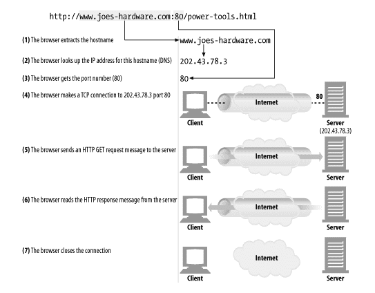
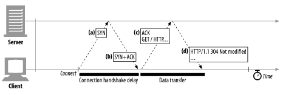
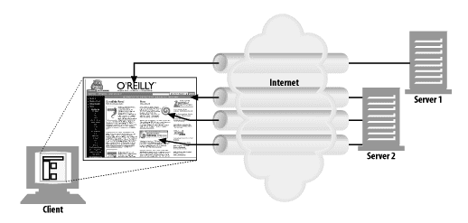
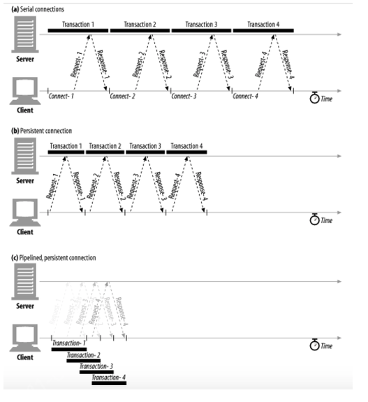
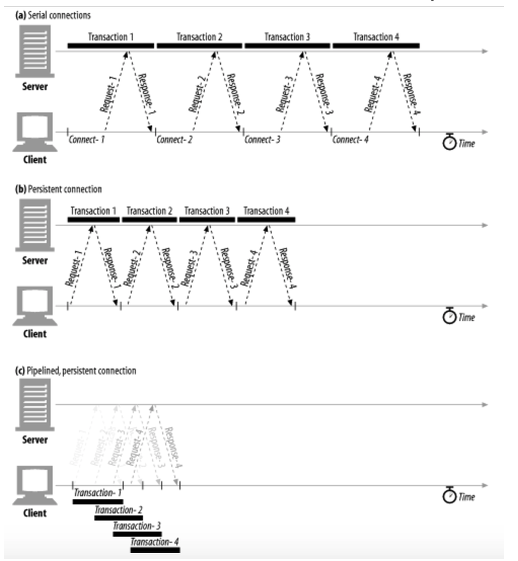

# Connection management

## 단원의 목표

* HTTP는 어떻게 TCP 커넥션을 사용하는가
* TCP 커넥션의 지연, 병목, 막힘
* 병렬 커넥션, keep-alive 커넥션, 커넥션 파이프라인을 활용한 HTTP 최적화
* 커넥션 관리를 위해 따라야 할 규칙들

## TCP 커넥션

일단 커넥션이 맺어지면 클라이언트와 서버 컴퓨터 간ㄴ에 주고받는 메시지들은 손실 혹은 손상되거나 순서가 바뀌지 않고 안전하게 전달된다.

### 신뢰할 수 있는 데이터 전송 통로인 TCP

HTTP 커넥션은 몇몇 사용 규칙을 제외하고는 TCP 커넥션에 불과하다.
TCP는 HTTP에게 신뢰할만한 통신 방식을 제공한다. TCP 커넥션의 한쪽에 있는 바이트들은 반대쪽으로 순서에 맞게 정확히 전달된다.

### TCP 스트림은 세그먼트로 나뉘어 IP 패킷을 통해 전송된다

TCP는 IP 패킷(혹은 IP 데이터그램)이라고 불리는 작은 조각을 통해 데이터를 전송한다.
HTTP에 보안기능을 더한 HTTPS는 TLS 혹은 SSL이라 불리기도 하며 HTTP와 TCP 사이에 있는 암호화 계층이다.

HTTP가 메시지를 전송하고자 할 경우, 현재 연결되어 있는 TCP 커넥션을 통해서 메시지 데이터의 내용을 순서대로 보낸ㄴ다.
TCP는 세그먼트라는 단위로 데이터 스트림을 잘게 나누고, 세그먼트를 IP 패킷이라고 불리는 봉투에 담아서 인터넷을 통해 데이터를 전달한다.

각 TCP 세그먼트는 하나의 IP 주소에서 다른 IP주소로 IP패킷에 담겨 전달된다. 이 IP 패킷들 각각은 다음을 포함한다.

* IP 패킷 헤더(약 20바이트)
* TCP 세그먼트 헤더(약 20바이트)
* TCP 데이터 조각(0 혹은 그 이상의 바이트)

IP 헤더는 발신지와 목적지 IP주소, 크기, 기타 플래그를 가진다.
TCP 세그먼트 헤더는 TCP 포트 번호, TCP 제어 플래그, 그리고 데이터의 순서와 무결성을 검사하기 위해 사용되는 수자 값을 포함한다.

### TCP 커넥션 유지하기

컴퓨터는 항상 TCP 커넥션을 여러 개 가지고 있다. TCP는 포트 번호를 통해서 이런 여러 개의 커넥션을 유지한다.

> <발신지 IP주소, 발신지 포트, 수신지 IP주소, 수신지 포트>

이 네 가지 값으로 유일한 커넥션을 생성한다.

## TCP 성능에 대한 고려

HTTP는 TCP 바로 위에 있는 계층이기 때문에 HTTP 트랜잭션의 성능은 그 아래 계층인 TCP 성능에 영향을 받는다.
기본적인 TCP 성능의 특성을 이해함으로써 HTTP의 커넥션 최적화 요소들을 더 잘 알게되고 더 좋은 성능의 HTTP 애플리케이션을 설계하고 구현할 수 있게 될 것이다.

### HTTP 트랜잭션 지연

클라이언트나 서버가 너무 많은 데이터를 내려받거나 복잡하고 동적인 자원들을 실행하지 않는 한, 대부분의 HTTP 지연은 TCP 네트워크 지연 때문에 발생한다.

HTTP 트랜잭션의 지연 원인

* 처음 접근하는 Host에 대해서 DNS 분석을 위한 시간이 필요
* 클라이언트가 TCP 커넥션 요청을 서버에게 보내고 서버가 커넥션 허가 응답을 회신하길 기다리는 시간(새로운 TCP 커넥션 연결시 마다)
* 클라이언트가 서버로, 서버가 클라이언트로 데이터들 보내는 시간

### 성능 관련 중요 요소

* TCP 커넥션의 핸드셰이크 설정
* 인터넷의 혼잡을 제어하기 위한 TCP의 slow-start
* 데이터를 하곳에 모아 한 번에 전송하기 위한 네이글 알고리즘
* TCP Piggyback 확인응답(ack)을 위한 확인응답 지연 알고리즘
* TIME_WAIT 지연과 포트 고갈

### TCP 커넥션 핸드셰이크 지연

어떤 데이터를 전송하든 새로운 TCP 커넥션을 열 때면, TCP 소프트웨어는 커넥션을 맺기 위한 조건을 맞추기 위해 연속으로 IP 패킷을 교환한다. **작은 크기의 데이터 전송에 커넥션이 사용된다면 이런 패킷 교환은 HTTP 성능을 크게 저하시킬 수 있다.**

크기가 작은 HTTP 트랜잭션은 50%이상의 시간을 TCP 구성하는데 쓴다.(커넥션 재활용 필요)

### 확인응답 지연

인터넷 자체가 패킷 전송을 완벽히 보장하지는 않기 때문에 TCP는 성공적인 데이터 전송을 보장하기 위해서 자체적인 확인 체계를 가진다.
각 TCP 세그먼트는 순번과 데이터 무결성 체크섬을 가진다. 각 세그먼트 수신자는 세그먼트를 온전히 받으면 작은 확인응답 패킷을 송신자에게 반환한다. 송신자가 특정 시간 안에 받지 못하면 재전송을 한다.

확인응답은 크기가 작기 때문에, TCP 같은 방향으로 송출되는 데이터 패킷에 확인응답을 편승(piggyback) 시킨다. 이런 효율성을 높이기 위해서 TCP 스택은 확인응답 지연 알고리즘을 구현한다. 확인응답 지연은 송출할 확인응답을 특정 시간 동안(보통 0.1~0.2초) 버퍼에 저장해 두고, 확인응답을 편승시키기 위한 송출 데이터 패킷을 찾는다. 못찾으면 별도로 패킷을 생성한다.

### TCP Slow Start

TCP의 데이터 전송 속도는 TCP 커넥션이 만들어진 지 얼마나 지났는지에 따라 달라질 수 있다. TCP 커넥션은 시간이 지나면서 자체적으로 튜닝되어서 처음에는 커넥션이 최대 속도를 제한하고 데이터가 성공적으로 전송됨에 따라서 속도 제한을 높여간다. 이렇게 조율하는 것을 TCP slow start라고 부르며, 이는 급작스러운 부학와 혼잡을 방지하는데 쓰인다.

TCP 느린 시작은 TCP가 한 번에 전송할 수 있는 패킷의 수를 제한한다. 간단히 말해서, 패킷이 성공ㅇ적으로 전달되는 각 시점에 송신자는 추가로 2개의 패킷을 더 전송할 수 있는 권한을 얻는다. HTTP 트랜잭션에서 전송할 데이터의 양이 많으면 모든 패킷을 한 번에 전송할 수 없다. 그 대신 한 개의 패킷만 전송하고 확인응답을 기다려야 한다. 확인응답을 받으면 2개의 패킷을 보낼 수 있으며, 그 패킷 가각에 대한 확인응답을 받으면 총 4개의 패킷을 보낼 수 있게된다. (Congestion window 조절)

### 네이글(Nagle) 알고리즘과 TCP_NODELAY

작은 패킷의 전송은 네트워크 성능을 크게 떨어뜨린다. 그래서 작은 패킷들을 모아서 한번에 보내자라는 알고리즘이 네이글 알고리즘이다.
하지만 작은 데이터들을 모으기위한 기다림과 piggyback을 이용한 확인응답 지연 알고리즘과 충돌되어 또 다른 문제를 발생시킨다. 이르 위해서 HTTP 스택에 TCP_NODELAY 파라미터 값을 설정해 네이글 알고리즘을 비활성화 할 수 있다. 이 때 작은 크기의 패킷이 너무 많이 생기지 않도록 주의해야한다.

### TIME_WAIT의 누적과 포트 고갈

해당 문제는 보통 실제 상황에서는 발생하지 않지만 성능테스트를 할 경우에 발생해서 오해를 불러이르킬 수 있다.

TCP 커넥션의 종단에서 TCP 커넥션을 끊으면, 종단에서는 커넥션의 IP 주소와 포트 번호를 메모리의 작은 제어영역(control block)에 기록해 놓는다. 이는 이전 커넥션과 관련된 패킷이 그 커넥션과 같은 주소와 포트번호를 가지는 새로운 커넥션에 삽입되는 문제를 방지한다. 제어영역에 보관되는 시간과 관련해 가능한 연결의 조합이 제한되며, TIME_WAIT로 인해서 순간순간 포트를 재활용하는것이 불가능해지는 경우가 생긴다.

포트 고갈 문제를 겪지 않더라도, 커넥션을 너무 많이 맺거나 대기 상태로 있는 제어 블록이 너무 많아지는 상황은 주의해야한다.

## HTTP 커넥션 관리

### 흔히 잘못 이해하는 Connection 헤더

커넥션 토큰이 HTTP 헤더 필드 명을 가지고 있으면, 해당 필드들은 현재 커넥션만을 위한 정보이므로 다음 커넥션에 전달하면 안된다.

### 순차적인 트랜잭션 처리에 의한 지연

순차적인 처리로 인한 지연에는 물리적인 지연뿐 아니라, 하나의 이미지를 내려받고 있는 중에는 웹페이지느 나머지 공간에 아무런 변화가 없어서 느껴지는 심리적 지연도 있다.

이를 해결하기 위해서는 다음과 같은 솔루션들이 있다.

* 병렬 커넥션 : 여러 개의 TCP 커넥션을 통한 동시 HTTP 요청
* 지속(persistent) 커넥션 : 커넥션을 맺고 끊는 데서 말생하는 지연을 제거하기 위한 TCP 커넥션 재활용
* 파이프라인 커넥선 : 공유 TCP 커넥션을 통한 병렬 HTTP 요청
* 다중(multiplexed) 커넥션 : 요청과 응답들에 대한 중재

## 병렬 커넥션

HTTP는 클라이언트가 여러 개의 커넥션을 맺음으로써 여러 개의 HTTP 트랜잭션을 병렬로 처리할 수 있게 한다.

### 병렬 커넥션이 항상 더 빠르지는 않다.

일반적으로는 병렬 커넥션이 더 빠르긴 하지만 항상 그렇지는 않다. 네트워크 대역 폭이 좁을 때는 대부분 시간을 데이터를 전송하는데만 쓸 것이다. 여러 개의 객체를 병렬로 내려받는 경우, 이 제한된 대역폭 내에서 각 객체를 전송받는것은 느리기 때문에 성능상의 장점은 거의 없어진다.

또한 다수의 커넥션은 모메로를 많이 소모하고 자체적인 성능문제를 발생시킨다.

## 지속 커넥션

웹 클라이언트는 보통 같은 사이트에 여러 개의 커넥션을 맺는다. 예를들어 웹페이지에 첨부된 이미지들 대부분은 같은 웹 사이트에 있고, 상당수의 하이퍼링크도 같은 사이트를 가리킨다. 따라서 서버에 HTTP 요청을 하기 시작한 애플리케이션은 웹페이지 내의 이미지 등을 가져오기 위해서 그 서버에 또 요청하게 될 것이다.(`Site Locality`)

따라서 HTTP/1.1을 지원하는 기기는 처리가 완료된 후에도 TCP 커넥션을 유지하여 앞으로 있을 HTTP 요청에 재사용할 수 있다. 처리가 완료된 후에도 계속 연결된 상태로 있는 TCP 커넥션을 지속 커넥션이라고 부른다.

비지속 커넥션은 각 처리가 끝날 때마다 커넥션을 끊지만, 지속 커넥션은 클라이언트나 서버가 커넥션을 끊기 전까지는 트랜잭션 간에도 커넥션을 유지한다.

해당 서버는 이미 맺어져 있는 지속 커넥션을 재활용 함으로써, 커넥션을 맺기 위한 준비작업에 따르는 시간을 절약할 수 있다. 게다가 이미 맺어져 있는 커넥션은 TCP slow start로 인한 지연을 피함으로써 더 빠르게 데이터를 전송할 수 있다.

### 지속 커넥션 vs 병렬 커넥션

병렬 커넥션에는 몇가지 단점이 있다.

* 각 트랜젝션마다 새로운 커넥션을 맺고 끊기 때문에 시간과 대역폭이 소요된다.
* 각각의 새로운 커넥션은 TCP 느린 시작 때문에 성능이 떨어진다.
* 실제로 연결할 수 있는 병렬 커넥션의 수에는 제한이 있다.

지속 커넥션은 병렬 커넥션에 비해 몇 가지 정점이 있다.
커넥션을 맺기 위한 사전 작업과 지연을 줄여주고, 튜닝된 커넥션을 유지하며 커넥션의 수를 줄여준다.
하지만 지속 커넥션을 잘못 관리할 경우, 계속 연결된 상태로 있는 수많은 커넥션이 쌓이게 될 것이다. 이는 로컬의 리소스 그리고 원격의 클라이언트와 서버의 리소스에 불필요한 소모를 발생시킨다.

지속 커넥션은 병렬 커넥션과 함꼐 사용될 때에 가장 효과적이다. 오늘날 많은 웹 애플리케이션은 적은 수의 병렬 커넥션만을 맺고 그것을 유지한다. 두 가지 지속 커넥션 타입이 있는데 HTTP/1.0+에서는 `keep-alive` 커넥션이 있고, HTTP/1.1에는 `persistent` 커넥션이 있다.

### HTTP/1.0+의 Keep-Alive 커넥션

해당 버전에서는 설계상의 문제가 있었으나 HTTP/1.1에서는 수정되었다. 아래 그림은 연속적으로 네 개의 커넥션을 생성하여 처리하는 방식과 하나의 지속 커넥션으로만 처리하는 방식을 비교하였다. 커넥션을 맺고 끊는 데 필요한 작업이 없어서 시간이 단축되었다.

### Keep-Alive 동작

keep-alive는 사용하지 않기로 결정되어 HTTP/1.1 명세에서는 빠졌다. (하지만 아직도 많이 사용됨)
HTTP/1.0 keep-alive 커넥션을 구현한 클라이언트는 커넥션을 유지하기 위해서 요청에 `Connection:Keep-Alive` 헤더를 포함시킨다. 이 요청을 받은 서버는 그 다음 요청에도 이 커넥션을 통해 받고자 한다면, 응답 메시지에 같은 헤더를 포함시켜 응답한다.

### Keep-Alive 커넥션 제한과 규칙

웹 클라이언트가 무조건 전달을 하는 멍청한 프락시를 거쳐 웹 서버에 메시지를 전송했을 때 상황

1. 웹 클라이언트는 프락시에 Connection: Keep-Alive 헤더와 함께 메시지를 보내고 커넥션 유지 요청에 대한 응답을 기다린다.
2. 멍청한 프락시는 keep-alive를 이해하지 못하고 다음 서버로 메시지를 그대로 전달한다.
하지만 Connection 헤더는 홉별 헤더(다음 서버로 전송되면 안되는 헤더)이기 때문에 여기부터 문제가 발생한다.
웹 서버가 프락시로부터 Connection: Keep-Alive 헤더를 받으면, 웹 서버는 프락시가 커넥션을 유지하자고 요청하는 것으로 잘못 판단한다.
3. 웹 서버는 프락시와 커넥션을 유지하는 것에 동의를 하고 Connection: Keep-Alive 헤더를 포함하여 응답한다.
웹 서버는 프락시와 keep-alive 커넥션이 맺어져 있는 상태로 판단하여 그에 대한 규칙에 맞게 통신하지만 프락시는 keep-alive를 전혀 이해하지 못한다.
4. 멍청한 프락시는 서버로부터 받은 Connection: Keep-Alive 헤더를 포함한 응답을 클라이언트에게 전달한다.
클라이언트와 서버는 서로 keep-alive에 동의했다고 생각하지만 프락시는 이 상황을 전혀 이해하지 못한다.
5. 프락시는 응답을 클라이언트에게 전달한 후 서버가 커넥션을 끊기를 기다린다.
하지만 서버는 커넥션을 유지하는 것으로 알고 있기 때문에 커넥션을 끊지 않고 프락시는 계속 기다린다.
6. 클라이언트는 다음 요청을 프락시에게 보내기 시작하는데, 프락시는 다음 요청이 오는 것을 예상하지 못하기 때문에,
그 요청은 프락시로부터 무시되고 브라우저는 응답을 계속 기다리게된다.
7. 이런 잘못된 통신 때문에, 브라우저는 자신이나 서버가 타임아웃이 나서 커넥션이 끊길 때까지 기다린다.

### HTTP/1.1의 지속 커넥션

* HTTP/1.1에서는 keep-alive 대신 설계가 더 개선된 지속 커넥션을 지원한다.
* keep-alive와 달리 지속 커넥션은 기본적으로 활성화되어 있다. (별도의 설정을 하지 않는 한 모든 커넥션은 지속 커넥션)
* HTTP/1.1 애플리케이션은 지속 커넥션은 끊으려면 Conneciton: close 헤더를 명시해야 한다.
* Connection: close 헤더가 없으면 응답 후에도 커넥션은 유지하자는 것으로 추정하지만 클라이언트와 서버는 언제든 커넥션을 끊을 수 있다.

###  지속 커넥션의 제한과 규칙

* 클라이언트가 요청에 Connection: close 헤더를 포함해 보냈으면, 클라이언트는 그 커넥션으로 추가적인 요청을 보낼 수 없다.
클라이언트는 추가적인 요청이 없다면 마지막 요청에 Connection: close 헤더를 포함해 보내야 한다.
커넥션에 있는 모든 메시지는 엔터티 본문의 정확한 Content-Length 값을 가지거나 청크 전송 인코딩으로 인코드 되어 있어야 한다.
* HTTP/1.1 프락시는 클라이언트가 서버 각각에 대해 별도의 지속 커넥션을 맺고 관리해야 한다.
* HTTP/1.1 프락시 서버는 클라이언트가 커넥션 관련 기능에 대한 클라이언트의 지원 범위를 알고 있지 않은 한 지속 커넥션을 맺으면 안된다.
* HTTP/1.1 기기는 Connection 헤더의 값과는 상관없이 언제든지 커넥션을 끊을 수 있다.
* HTTP/1.1 애플리케이션은 중간에 끊어지는 커넥션을 복구할 수 있어야 하고, 클라이언트는 다시 보낼 수 있는 요청이라면 다시 보내야 한다.
* 하나의 클라이언트는 서버 과부하 방지를 위해 두개 이상의 지속 커넥션을 유지해야 한다.(N명의 사용자가 서버로 접근한다면 2N개의 커넥션 유지)

## 파이프라인 커넥션

HTTP/1.1은 지속 커넥션을 통해서 요청을 파이프라이닝할 수 있다. 이는 keep-alive 커넥션의 성능을 더 높여준다. 여러 개의 요청은 응답이 도착하기 전까지 큐에 쌓인다. 

### 파이프라인 제약사항

* HTTP 클라이언트는 커넥션이 지속 커넥션인지 확인하기 전까지는 파이프라인을 이어서는 안된다.
* HTTP 응답은 요청의 순서와 같게 들어와야 한다. HTTP 메시지는 순번이 없기 때문에 제 각각 오면 정렬시킬 방법이 없다.
* 클라이언트가 지속 커넥션은 맺고 10개의 요청을 보냈을 때 서버는 5개만 처리하고 커넥션을 끊을 수 있는데, 클라이언트는 이 커넥션은 다시 맺고 요청을 보낼 수 있어야 한다.
* HTTP는 POST와 같은 비멱등 메서드는 반복 요청시 문제가 생길 수 있기 때문에 파이프라인을 통해 보내면 안된다.

> 비멱등이란?

> POST는 보통 회원가입이나 글 작성 등에 사용하는 HTTP 메서드이기 때문에 요청을 보낼 때마다 서버에 변화가 생긴다.
> 반면 GET 메서드는 여러번 요청을 하여도 서버에 변화가 생기지 않기 때문에 멱등이라고 할 수 있다.

## 커넥션 끊기에 대한 미스터리

커넥션 관리(특히 언제 어떻게 커넥션을 끊는가)에는 명확한 기준이 없다.
이 이슈는 수많은 개발자가 알고 있는 것보다 더 미묘하며, 그에 관한 기술 문서도 별로 없다.

### '마음대로' 커넥션 끊기

* HTTP 클라이언트, 서버, 혹은 프락시는 언제든지 TCP 전송 커넥션을 끊을 수 있다.
* 보통 커넥션은 메시지를 다 보낸 다음 끊지만, 에러가 있는 상황에서는 헤더의 중간이나 다른 엉뚱한 곳에서 끊길 수 있다.
* 지속 커넥션이 일정 시간 동안 요청을 전송하지 않고 유휴 상태에 있으면 서버는 그 커넥션을 끊을 수 있다.
* 하지만 서버가 유휴 상태에 있는 커넥션을 끊는 시점에, 서버는 클라이언트가 다시 요청하지 않을 것이라고 확신하지 못한다. 클라이언트가 다음 요청을 보낸다면 문제가 생긴다.

### Content-Length와 Truncation

* 각 HTTP 응답은 본문의 정확한 크기 값을 가지는 Content-Length 헤더를 가지고 있어야 한다.
* 클라이언트나 프락시가 커넥션이 끊어졌다는 HTTP 응답을 받은 후, 실제 전달 된 엔터티 본문의 길이와 Content-Length가 일치하지 않거나 Content-Length 헤더가 존재하지 않는다면 수신자는 데이터의 정확한 길이를 서버에게 물어봐야 한다.
* 만약 수신자가 캐시 프락시일 경우 응답을 캐시하면 안되며, Content-Length를 정정하려 하지 말고 메시지를 받은 그대로 전달해야 한다.

### 커넥션 끊기의 허용, 재시도, 멱등성

* 커넥션은 에러가 없더라도 언제든 끊을 수 있다.
* HTTP 애플리케이션은 예상치 못하게 커넥션이 끊어졌을 경우를 대응할 수 있도록 준비해야 한다.
* 클라이언트는 트랜잭션 수행 중 커넥션이 끊어졌을 때 다시 트랜잭션을 전송해도 문제가 없다면 커넥션은 다시 맺고 한번 더 전송해야 한다.
* GET 요청은 반복적으로 요청하더라도 결과적으로 아무런 영향을 끼치지 않지만, 온라인 서점에서 주문을 하는 POST 요청은 ( * * 반복할 경우 여러 번 주문이 될 것이기 때문에 반복은 피해야 한다.
* 한 번 혹은 여러 번 실행해도 같은 결과를 반환한다면 그 트랜잭션은 멱등(idempotent)하다고 한다.
* GET, HEAD, PUT, DELETE, TRACE, OPTIONS 메서드들은 멱등
* POST와 같은 비멱등 메서드는 파이프라인을 통해 요청하면 안된다.
* 비멱등 요청을 다시 보내야 한다면, 이전 요청에 대한 응답을 받을 때까지 기다려야 한다.
* 비멱등 메서드나 순서에 대해 에이전트가 요청을 다시 보낼 수 있도록 기능을 제공할 때 자동으로 재시도하면 안된다. 캐시된 POST 요청 페이지를 다시 로드하려고 할 때, 요청을 다시 보내기를 원하는지 묻는 대화상자를 보여준다.

### 우아한 커넥션 끊기

TCP 커넥션은 양방향이며 양쪽에는 데이터를 읽거나 쓰기 위한 입력 큐와 출력 큐가 있다. 한쪽 출력 큐에 있는 데이터는 다른 쪽의 입력 큐에 보내질 것이다.

#### 전체 끊기와 절반 끊기

* 애플리케이션은 TCP 입력 채널과 출력 채널 중 한 개만 끊거나 둘 다 끊을 수 있다.
* close()를 호출하면 TCP 커넥션의 입력 채널과 출력 채널의 커넥션을 모두 끊는다. (전체 끊기)
* shutdown()을 호출하면 입력 채널이나 출력 채널 중 하나를 개별적으로 끊을 수 있다. (절반 끊기)

#### TCP 끊기와 리셋 에러

* 단순한 HTTP 애플리케이션은 전체 끊기만을 사용할 수 있다.
* 하지만 애플리케이션은 다른 애플리케이션들과 통신할 때, 그리고 그들과 파이프라인 지속 커넥션을 사용할 때, 기기들에 예상치 못한 쓰기 에러를 발생하는 것을 예방하기 위해 '절반 끊기'를 사용해야 한다.
* 보통은 커넥션의 출력 채널을 끊는 것이 안전하다.
* 클라이언트에서 이미 끊긴 입력 채널에 데이터를 전송하면, 서버의 운영체제는 TCP 'connection reset by peer' 메시지를 클라이언트에게 보낸다.
* 대부분 운영체제는 이것을 심각한 에러로 취급하여 버퍼에 저장된, 아직 읽히지 않은 데이터를 모두 삭제한다.

#### 우아하게 커넥션 끊기

* 우아한 커넥션 끊기를 구현하는 것은 애플리케이션 자신의 출력 채널을 먼저 끊고 다른 쪽에 있는 기기의 출력 채널을 끊기는 것을 기다리는 것이다.