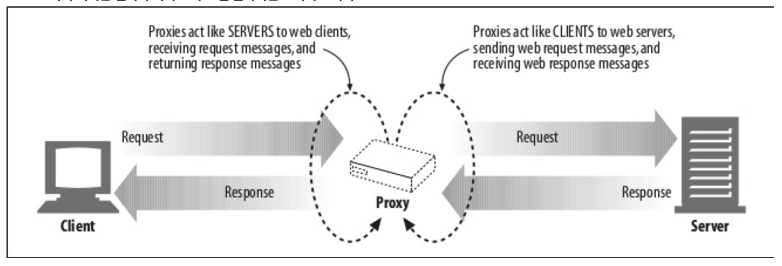
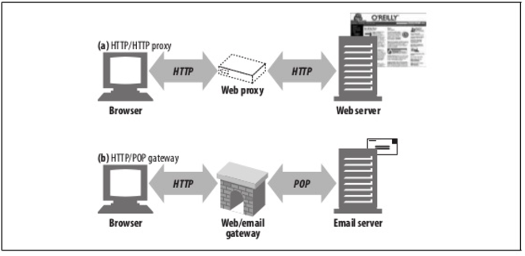
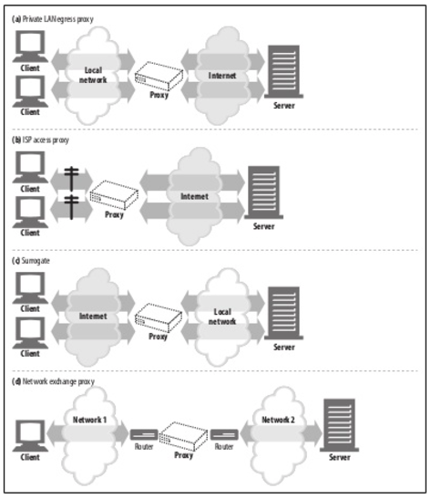
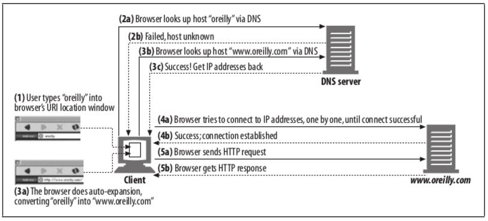
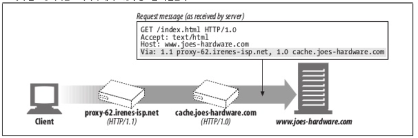
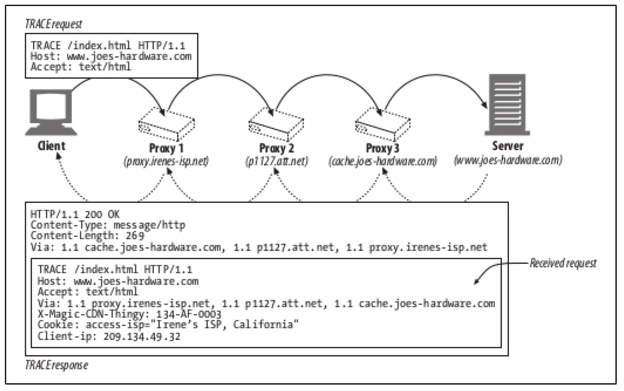

# Proxy

 - 웹 프락시 서버는 중개자다. 프락시는 클라이언트와 서버 사이에 위치하여 그들 사이의 HTTP 메시지를 정리하는 중개인처럼 동작한다.
 - `HTTP Proxy` vs `웹 게이트웨이`

## 웹 중개자
 - 웹 프락시 서버는 클라이언트의 입장에서 트랜잭션을 수행하는 중개인이다.
 - 웹 프락시가 없다면, 클라이언트는 HTTP 서버와 직접 이야기한다.
 - HTTP 프락시 서버는 웹 서버이기도 하고 웹 클라이언트이가도 하다.
 

### 개인 프락시와 공유 프락시
 - 하나의 클라이언트가 독점적으로 사용하는 것을 개인 프락시, 여러 클라이언트가 공유하는 경우에는 공유 프락시라고 한다.
 -  `공용 프락시` : 대부분의 프락시는 공용이며 공유된 프락시다. 캐시 프락시서버와 같이 여러 사용자들의 공통된 요청에서 이득을 취할 수 있는 경우에 사용.
 - `개인 프락시` : 흔하지 않고, ISP 서비스와 마찬기지로 브라우저 기능을 확정하거나 성능개선에 사용.

### Proxy vs Gateway
 - 프락시는 같은 프로터콜을 사용하는 둘 이상의 애플리케이션을 연결, 게이트웨이는 서로 다른 프로토콜을 사용하는 둘 이상을 연결(ex, email gateway)
 

## 왜 프락시를 사용하는가?
 - 보안 개선, 성능 개선, 비용 절약
 - 프락시 서버는 모든 HTTP 트래픽을 들여다보고 건드릴 수 있기 때문에 트래픽을 감시/수정 가능
 - ex) 교육기관 필터 프록시, 기관 문서 접근 제어자, 보안 방화벽, 웹 캐시, 컨텐츠 라우터, 트랜스코딩(번역, 이미지 인코딩), 익명화 프락시(User-Agent 삭제, From / Referer / Cookie 헤더 삭제)

## 프락시는 어디에 위치하는가?

### 프락시 서버 배치
 - Egress(출구) 프락시 : 방화벽 제공, 인터넷 트래픽 성능 개선, 교육기관 콘텐츠 필터용으로 사용가능
 - Ingress(입구) 프락시 : 고객으로부터 오는 모든 요청을 종합적으로 처리하기 위함, 캐시 프락시를 사용해 많이 찾는 문서 사본을 저장
 - 대리 프락시(리버스 프락시) : 웹 서버의 바로 앞에 위치해 웹 서버로 향하는 모든 요청을 처리하고 필요할 때만 웹 서버에게 자원을 요청, 웹 서버의 보안 기능 추가, 캐시를 이용해 성능 개선 가능
 - 네트워크 교환 프락시 : 캐시를 이용해 인터넷 교차로의 혼잡을 완화하고 트래픽 흐름을 감지하기 위해 네트워크 사이의 인터넷 피어링 교환 지점에 위치
 

#### 프락시 계층 콘텐츠 라우팅
 - 부하균형 : 자식 프락시는 부모들의 작업량 수준에 근거하여 부모 프락시를 고른다.
 - 지리적 인접성에 근거한 라우팅 : 자식 프락시는 원 서버의 지역을 담당하는 부모를 선택할 수 있다.
 - 프로토콜/타입 라우팅 : URI에 근거하여 다른 부모나 원 서버로 라윙 할 수 있다.
 - 유료 서비스 가입자를 위한 라우팅 : 유료 사용자에게 대형 캐시나 성능 개선을 위한 압축 엔진으로 라우팅 될 수 있다.

#### 프락시 설정 방법
 - 클라이언트 수정 : 웹 브라우저에서 자동/수동 프락시 설정
 - 네트워크 수정 : 클라이언트가 모르게 네트워크를 가로채서 수정하는 방식, 스위칭 장치와 라우팅장치가 필요(인터셉트 프락시)
 - DNS 변경 : 실제 서버의 IP주소와 이름은 변경되고 대리 프락시에게는 이전의 주소와 이름이 주워진다.
 - 웹서버 수정 : 웹서버에서 HTTP 리다이렉션 명령(305)를 클라이언트에게 돌려줌. 

## 프락시의 특징들

### 프락시 URI는 서버 URI와는 다르다.
 - 클라이언트가 프락시 대신 서버로 요청을 보내면 요청의 URI가 달라진다.
 - 클라이언트가 웹 서버로 요청을 보낼 때
 ```
 GET /index.html HTTP/1.0
 User-Agent: SuperBrowserv1.3
 ```
 - 클라이언트가 프락시로 요청을 보낼 때,
 ```
 GET http://www.marys-antiques.com/index.html HTTP/1.0
 User-Agent: SuperBrowserv1.3
 ```
 - 프락시가 없었을 때는 불필요한 정보 발송을 피하기 위해서 스킴과 호스트 없는 부분 URI만 보냈다.
 - 프락시가 생기고나서 HTTP/1.0에서는 이 문제를 해결하기 위해서 프락시 요청의 경우 완전한 URI를 요구하는 것으로 이 문제를 해결

### 가상 호스팅에서 일어나는 같은 문제
 - 명시적인 프락시는 요청 메시지가 완전한 URI를 갖도록 함으로써 이 문제를 해결했다.
 - 가상으로 호스팅 되는 웹 서버는 호스트와 포트에 대한 정보가 담겨 있는 Host 헤더를 요구한다.

### 인터셉트 프락시는 부분 URI를 받는다.
 - 리버스 프락시나 인터셉트 프락시는 클라이언트에서 그 존재를 모르기 때문에 부분 URI를 사용하게 된다.

### 프락시는 프락시 요청과 서버 요청을 모두 다룰 수 있다.
 - 완전한 URI가 주어졌다면, 프락시는 그것을 사용해야 한다.
 - 부분 URI가 주어졌고 Host 헤더가 있다면, Host 헤더를 이용해 원 서버의 이름과 포트번호를 알아내야 한다.
 - 부분 URI가 주어졌으나 Host 헤더가 없다면 다음의 방법으로 원 서버를 알아내야 한다.
    - 프락시가 원 서버를 대신하는 대리 프락시라면, 프락시에 실제 서버의 주소와 포트 번호가 설정되어 있을 수 있다.
    - 이 전에 어떤 인터셉트 프락시가 가로챘던 트래픽을 받았고, 그 인터셉트 프락시가 원 IP 주소와 포트번호를 사용할 수 있도록 해두었다면, 그 IP 주소와 포트번호를 사용할 수 있다.

### 전송 중 URI 변경
 - 상호운용성 문제를 고려햐여 프락시 서버는 일반적으로 가능한 관대하도록 애써야 한다.

### URI 클라이언트 자동확장과 호스트명 분석(Hostname Resolution)
 - `www`를 접두사, `.com`을 접미사로 붙인다. (`www.yahoo.com` 대신 `yahoo`만 입력해도 되도록 허용)
 - DNS가 사용자 호스트 명의 앞부분만 입력하면 자동으로 도메인을 검색하도록 설정.

### 프락시 없는 URI 분석(URI Resolution)
 - 아래 그림은 프락시 없는 브라우저 호스트 명 자동확장을 보여준다.
 - 브라우저는 유효한 호스트 명이 발견될 때까지 다양한 호스트 명의 가능성들을 검색한다.
 

### 명시적인 프락시를 사용할 때의 URI 분석
 - 브라우저는 명시적인 프락시가 있는 경우 부분 호스트 명을 자동확장하지 않는다.
 - 그 결과 브라주에저 'oreilly'라고 타이핑하게 되면, 프락시는 'http://oreilly/'라고 보낸다.(기본 스킴과 경로를 추가하지만 호스트 명은 입력한 대로 남겨두었다.)

## 메시지 추적
 - 프락시는 여러 벤더에 의해 개발이 되고 서로 다른 기능과 버그들이 분포해 있기 때문에 프락시를 넘나드는 메시지의 흐름을 추적하고 문제점을 찾아내는 것도 필요한 일이 되었다.

### Via Header
 - via 헤더 필드는 메시지가 지나는 각 중간 노드(프락시, 게이트웨이)의 정보를 나열한다.


#### Server Header / Via Header
 - Server 응답 헤더 필드는 원 서버에 의해 사용되는 소프트웨어를 알려준다. 응답메시지가 프락시를 통과할 때, 프락시는 Server 헤더를 수정해서는 안된다.

### TRACE Method
 - 프락시 서버는 메시지가 전달될 때 메시지를 바꿀 수 있다.
 - HTTP 프락시 네트워크를 통해 홉에서 홉으로 전달될 때마다 메시지의 내용이 어떻게 변하는지 편리하게 관찰할 방법이 필요.
 - HTTP/1.1 TRACE 메서드는 요청 메시지를 프락시의 연쇄를 따라가면서 어떤 프락시즐 지나가고 어떻게 각 프락시가 요청 메시지를 수정하는지 관찰/추적할 수 있도록 해준다.
 