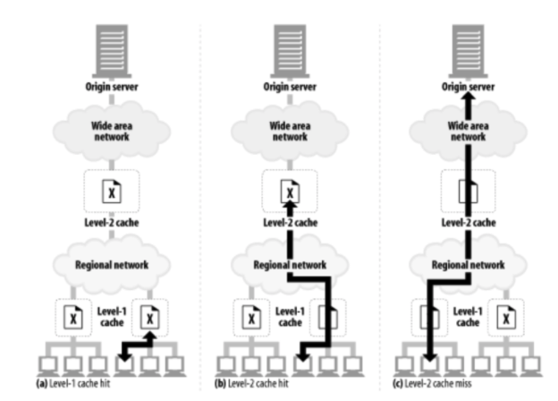
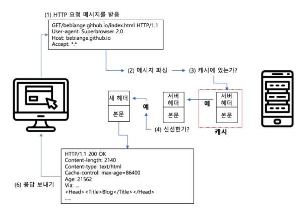

# Cache

웹 캐시는 자주 쓰이는 문서의 사본을 자동으로 보관하는 HTTP 장치다. 웹 요청이 캐시에 도착했을 때, 캐시된 로컬 사본이 존재한다면, 그 문서는 원 서버가 아니라 그 캐시로부터 제공된다.

## 캐시사용의 장점

* 불필요한 데이터 전송을 줄여서, 네트워크 요금으로 인한 비용을 줄여준다.(대역폭 및 시간)
* 원 서버에 대한 요청을 줄여준다. 서버부하를 줄이며 더 빨리 응답할 수 있다.
* 호출 거리로 인한 지연을 줄여준다.
* 갑작스러운 트래픽 증가(Flash Crowds)에 대해서 처리가능캐 해준다.

## 캐시사용시 고려사항

* Cache hit / Cache miss를 잘 고려해야함
* 재검사(Revalidation)를 통해서 콘텐츠가 유효한지 확인해가며 사용해야한다.
* 콘텐츠 변화가 없다면 원서버에서 `304 Not Modified` 응답을 준다.


* HTTP는 캐시된 객체를 재확인 하기위해 몇 가지 도구를 제공하는데, 그 중에서 가장 많이 쓰이는 것은 `If-Modified-Since` 헤더다. 서버에게 보내는 GET 요청에 이 헤더를 추가하면 캐시된 시간 이후에 변경된 경우에만 사본을 보내달라능 의미가 된다.
* 다음은 GET If-Modified-Since 요청이 서버에 도착했을 때 일어날 수 있는 세 가지 상황이다. (서버 콘텐츠가 변경되지 않은 경우, 서버 콘텐츠가 변경된 경우, 객체가 삭제된 경우)

* 재검사 적중 : 서버 객체가 변경되지 않았다면, 서버는 클라이언트에게 작은 HTTP 304 Not Modified 응답을 보낸다.


* 재검사 부적중 : 서버 객체가 캐시된 사본과 다르다면, 서버는 콘텐츠 전체와 함께 평범한 `HTTP 200 OK` 응답을 클라이언트에게 보낸다.
* 객체 삭제 : 서버 객체가 삭제되었다면, 서버는 `404 Not Found` 응답을 돌려보내며, 캐시는 사본을 삭제한다.

### Cache hit와 miss의 구분

불행히도 HTTP는 클라이언트에게 응답이 캐시 적중이었는지 원 서버 접근인지 말해줄 수 있는 방법을 제공하지 않는다. 두 경우 모두 200 OK 응답이다.
어떤 상용 프락시 캐시느느 캐시에 무슨 일이 일어났는지 설명하기 위해 Via 헤더에 추가 정보를 붙인다.
응답의 Date 헤더를 현재 시각과 비교하여 응답의 생성일이 더 오래되었다면 클라이언트는 응답이 캐시된 것임을 알 수 있다. (Age 헤더 또한 비슷하게 이용 가능하다.)

## 캐시 토폴로지

* 개인 전용 캐시 : 대부분의 브라우저는 자수 쓰이는 문서를 개인용 컴퓨터의 디스크와 메모리에 캐시해 놓고, 사용자가 캐시 사이즈와 설정을 수정할 수 있도록 허용한다.
* 공용 캐시


## 캐시 처리 단계

1. 요청받기 : 캐시는 네트워크로부터 도착한 요청 메시지를 읽는다.
2. 파싱 : 캐시는 메시지를 파싱하여 URL과 헤더들을 추출한다.
3. 검색 : 캐시는 로컬 복사본이 있는지 검사하고, 사본이 없다면 사본을 받아온다.
4. 신선도 검사 : 캐시는 캐시된 사본이 충분히 신선한지 검사하고, 신선하지 않다면 변경사항이 있는지 서버에게 물어본다.
5. 응답생성 : 캐시는 새로운 헤더와 캐시된 본문으로 응답 메시지를 만든다.
6. 발송 : 캐시는 네트워크를 통해 응답을 클라이언트에게 돌려준다.
7. 로깅 : 선택적으로 캐시는 로그파일에 트랜잭션에 대해 서술한 로그 하나를 남긴다.



## 사본을 신선하게 유지하기

캐시된 사본 모두가 서버의 문서와 항상 일치하는 것은 아니다.
HTTP는 어떤 캐시가 사본을 갖고 있는지 서버가 기억하지 않더라도, 캐시된 사본이 서버와 충분히 일치하도록 유지할 수 있게 해주는 단순한 메커니즘을 갖고 있다. HTTP는 이 단순한 메커니즘을 문서 만료와 서버 재검사라고 부른다.

### 문서 만료

HTTP는 Cache-Control과 Expires라는 특별한 헤더들을 이용해서 원 서버가 각 문서에서 유효기간을 붙일 수 있게 해준다.


일단 캐시된 문서가 만료되면, 캐시는 반드시 서버와 문서에 변경된 것이 있는지 검사해야하며, 만약 그렇다면 신선한 사본을 얻어와야한다.

### 유효기간과 나이

* `Cache-Control: max-age` : max-age 값은 문서의 최대 나이를 정의한다. 최대 나이는 문서가 처음 생성된 이후부터 제공하기엔 더 이상 신선하지 않다고 간주될 때까지 경과한 시간의 합법적인 최댓값(초단위)이다. ex) `Cache-Control: max-age=484200`
* `Expires`: 절대 유효기간을 명시한다. 마약 유효기간이 경과했다면, 그 문서는 더 이상 신선하지 않다. ex) `Expires: Fri, 05 Jul 2002, 05:00:00 GMT`

### 서버 재검사

캐시된 문서가 만료되었다는 것은 문서가 원 서버에 현재 존재하는 것과 실제로 다르다는 것을 의미하지는 않으며, 다만 이제 검사할 시간이 되었음을 뜻한다.
캐시는 문서의 신선도를 매 요청마다 검증할 필요가 없다. 문서가 만료되었을 때 한번만 서버와 재검사하면 된다. 이는 신선하지 않은 콘텐츠를 제공하지 않으면서도 서버 트래픽을 절약하고 사용자 응답 시간을 개선한다.

## 조건부 메서드와의 재검사

HTTP의 조건부 매서드는 재검사를 효율적으로 만들어준다. HTTP는 캐시가 서버에게 `조건부 GET` 이라는 요청을 보낼 수 있게 해준다.
이 요청은 서버가 갖고있는 문서가 캐시가 갖고 있는 것고 다른 경우에만 객체 본문을 보내달라고 하는 것이다.(신선도 검사와 객체를 받아오는 것을 결합)
HTTP는 다섯가지 조건부 요청 헤더를 정의한다.(`If-Modified-Since`, `If-None-Match` 가 유용함)

* `If-Modified-Since: <date>` : 만약 문서가 주어진 날짜 이후로 수정된다면 요청 메서드를 처리한다. 이것은 캐시된 버전으로부터 콘텐츠가 변경된 경우에만 콘텐츠를 가져오기 위해 `Last-Modified` 서버 응답 헤더와 함께 사용된다.
* `If-None-Match` : 마지막 변경된 날짜를 맞춰보는 대신, 서버는 문서에 대한 일련번호와 같이 동작하는 특별한 태그(ETag)를 제공할 수 있다. If-None-Match 헤더는 캐시된 태그가 서버에 있는 문서의 태그와 다를 떄만 요청을 처리한다.


### 언제 엔터티 태그를 사용하고 언제 Last-Modified를 사용하는가

HTTP/1.1 클라이언트는 만약 서버가 엔터티 태그를 반환했다면, 반드시 엔터티 태그 검사기를 사용해야한다.
만약 서버가 Last-Modified 값만을 반환했다면, 클라이언트는 If-Modified-Since 검사를 사용할 수 있다.
클라이언트는 각각을 위해 두 가지의 재검사 정책을 모두 사용해야 한다.
만약 HTTP/1.1 캐시나 서버가 If-Modified-Since와 엔터티 태그 조건부 헤더를 모두 받았다면, 요청의 모든 조건부 헤더 필드의 조건에 부합되지 않는 한 304 Not Modified 응답을 반환해서는 안된다.

## 캐시 제어

HTTP는 문서가 만료되기 전까지 얼마나 오랫동안 캐시될 수 있게 할 것인지 서버가 설정할 수 있는 여러가지 방법을 정의한다.

* Cache-Control: no-store 헤더를 응답에 첨부할 수 있다.
* Cache-Control: no-cache 헤더를 응답에 첨부할 수 있다.
* Cache-Control: must-revalidate 헤더를 응답에 첨부할 수 있다.
* Cache-Control: max-age 헤더를 응답에 첨부할 수 있다.
* Expires 날짜 헤더를 응답에 첨부할 수 있다.
* 아무 만료 정보도 주지 않고 캐시 스스로 휴리스틱 방법으로 결정한다.

### no-cache와 no-store
no-cache와 no-store 헤더는 캐시 서버가 검증되지 않은 상태의 캐시된 객체 사용을 금지한다.

```
Cache-Control: no-store
Cache-Control: no-cache
Pragma: no-cache
```

#### no-store
* no-store가 표시된 응답은 캐시 서버가 그 응답의 사본을 만드는 것을 금지한다.

#### no-cache
* no-cache로 표시된 응답은 먼저 서버와 재검사를 하지 않고서는 캐시 서버에서 캐싱한 데이터를 클라이언트에 제공할 수 없다.
* Do Not Serve From Cache Without Revalidation

#### Pragma: no-cache

* Pragma: no-cache 헤더는 HTTP/1.0+와의 하위 호환성을 위해 HTTP/1.1에 포함되어 있다.
* HTTP/1.1 어플리케이션은 Pragma: no-cache만 이해할 수 있는 HTTP/1.0 어플리케이션에 대응해야 하는 경우가 아니라면 Cache-Control: no-cache를 사용해야 한다.

### Expires 응답 헤더

더 이상 사용하지 않기를 권하는(deprecated) Expires 헤더는 초 단위의 시간 대신 실제 만료 날짜를 명시한다. HTTP를 설계한 사람들은 많은 서버가 동기화되어 있지 않거나 부정확한 시계를 갖고 있기 때문에 만료를 절대시각 대신 경과시간으로 표한하는 것이 낫다고 판단했다.